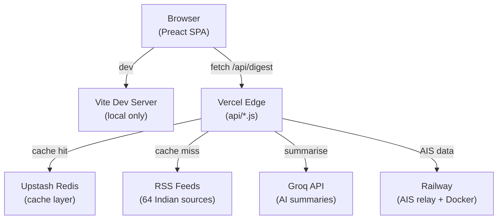
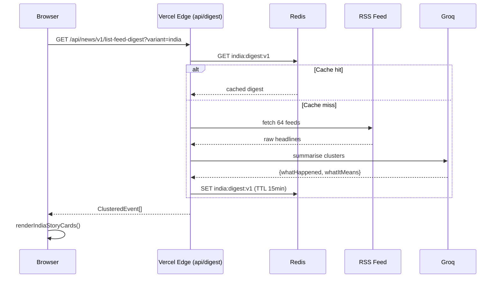
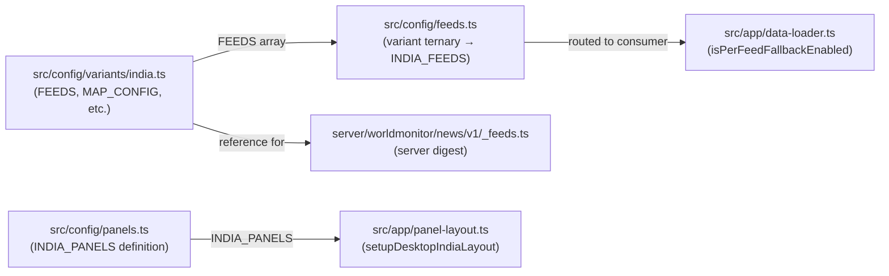

# Architecture Diagram Generator — SachNetra

> Generate clear diagrams for system architecture, data flow, and component relationships.

---

## When to Use

- Before starting a complex V2 task (understand before building)
- When explaining SachNetra's architecture to James or new contributors
- When planning how a new feature plugs into the existing system
- When a task touches multiple systems and the connections aren't obvious

---

## Step 1: Identify What to Diagram

Choose the right diagram type:

| Type | Use for |
|------|---------|
| **System overview** | High-level: browser → edge → server → data sources |
| **Data flow** | How a news story travels from RSS feed → digest → UI |
| **Component tree** | How Preact components relate (parent/child) |
| **Variant wiring** | How feeds/panels route through variant config |
| **API chain** | How a Vercel edge function handles a request |
| **V2 feature design** | Planning a new feature before building it |

---

## Step 2: Read the Relevant Code First

Do not draw from memory. Read the actual files:

```
System overview:
  AGENTS.md — repository map
  ARCHITECTURE.md — technical overview
  src/app/data-loader.ts — client data loading
  server/gateway.ts — server routing

Data flow (RSS → UI):
  src/config/feeds.ts → server/worldmonitor/news/v1/_feeds.ts
  → api/rss-proxy.js → server digest
  → src/app/data-loader.ts → src/components/

Variant wiring:
  src/config/variants/india.ts
  src/config/feeds.ts (FEEDS ternary)
  src/config/panels.ts (INDIA_PANELS definition)
  src/app/data-loader.ts (isPerFeedFallbackEnabled)
```

---

## Step 3: Generate the Diagram

Prefer **Mermaid** format (renders in GitHub, Obsidian, and most markdown viewers).

### System Overview (Mermaid)


### Data Flow: Story from RSS → UI (Mermaid)


### Variant Wiring (Mermaid)


---

## Step 4: Output Formats

### For GitHub / PR description
Wrap in Mermaid code block:
````markdown

````

### For Obsidian (ai_docs)
Save as `.md` file in `ai_docs/prep/` or `ai_docs/tasks/`:
```
ai_docs/prep/diagrams/system-overview.md
ai_docs/tasks/diagram-v2-landing-page-architecture.md
```

### For sharing with James (plain text ASCII)
```
Browser → Vercel Edge → Redis (cache) → Groq (AI)
                   ↓ cache miss
               RSS Feeds (64 sources)
```

---

## Step 5: Diagram Checklist

Before presenting:
- [ ] Reflects the actual code (not memory or assumptions)
- [ ] All important nodes labelled with real file names
- [ ] Arrows labelled with what flows (data type, HTTP method, etc.)
- [ ] Direction flows naturally (top-to-bottom or left-to-right)
- [ ] Simplified — shows the key relationships, not every detail
- [ ] Tested: paste Mermaid into mermaid.live to verify it renders

---

## Common SachNetra Diagram Subjects

1. **Full system architecture** (above)
2. **India variant wiring** — how india.ts data reaches the UI
3. **AI summary pipeline** — RSS → clustering → Groq → cache → UI
4. **V2 landing page routing** — Vercel rewrites for /app vs /
5. **WhatsApp brief flow** — Convex scheduled job → WABA → user phone
6. **State filtering** — how selectedState in app-context flows to rss.ts filter
7. **Share card pipeline** — cluster → Canvas 2D → Web Share API → WhatsApp
