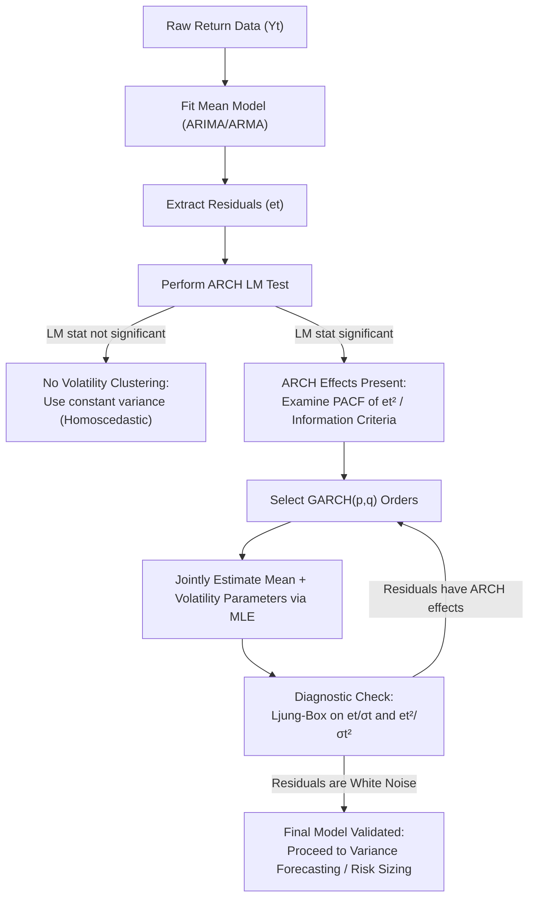

# Ep 48 — ARCH LM Test and GARCH Models

> **Why Lijo watched this**: To learn the formal statistical mechanism of the Lagrange Multiplier (LM) test for ARCH effects, understand how to identify optimal lag orders, examine the GARCH($p,q$) model formulation, and analyze the stationarity and forecasting properties of the GARCH(1,1) process.

---

## ⏱ Worth watching? WATCH

Verdict: **WATCH**

This lecture is a key session that connects volatility testing to generalized model structures. Focus on **1:30 to 7:15** for the mathematical construction of the Lagrange Multiplier (LM) test, including its null/alternative hypotheses and the $T \cdot R^2$ test statistic. Watch **7:55 to 11:30** to learn how to identify the optimal ARCH order using AIC/BIC and the PACF of squared residuals. The transition to GARCH models at **11:40 to 17:00** is also critical, specifically how GARCH(1,1) addresses the parameter explosion problem of basic ARCH models.

---

## What this episode is actually about (ELI12)

Before you can fit a volatility model to your stock data, you must prove that the volatility is actually changing over time. You do this using the **ARCH LM Test** (also known as Engle's ARCH test).

Think of it as a two-step process:
1.  First, you fit a standard model (like ARIMA) to remove the average path trend and extract the daily "surprises" (residuals).
2.  Next, you square these daily surprises (since squaring removes negative signs, giving us a proxy for risk/variance) and run a regression to see if today's surprise size depends on yesterday's surprise size.
    *   **Null Hypothesis**: Yesterday's surprise has zero impact on today's variance (no volatility clustering).
    *   **Alternative Hypothesis**: Yesterday's surprise significantly predicts today's variance.

If the test rejects the null, you have confirmed **ARCH effects** exist and must model them.

While you could use a high-order ARCH model, this requires estimating many coefficients. To solve this, Tim Bollerslev created the **GARCH model** in 1986. GARCH is like ARMA but for variance. Instead of today's risk depending only on past squared surprises (like ARCH), GARCH models today's risk as depending on *both* past surprises **and** *yesterday's forecasted risk itself*.

The most popular version is **GARCH(1,1)**:
$$\text{Today's Risk} = \text{Baseline} + (\text{Reactiveness} \times \text{Yesterday's Surprise}^2) + (\text{Persistence} \times \text{Yesterday's Risk})$$

If the sum of your Reactiveness ($\alpha$) and Persistence ($\beta$) is less than 1, the volatility is stable and will eventually pull back to a long-run average (called **mean reversion**).

---

## Key Concepts Introduced

- **Lagrange Multiplier (LM) Test / Engle's ARCH Test** — A statistical test to detect conditional heteroscedasticity by regressing squared residuals on their lagged values and analyzing the $T \cdot R^2$ statistic.
- **PACF of Squared Residuals** — A visual diagnostic tool where the partial autocorrelation plot of $e_t^2$ is examined to identify the cutting-off lag, which determines the optimal ARCH order $q$.
- **GARCH($p, q$) Model** — A Generalized Autoregressive Conditional Heteroscedastic model that expresses the current conditional variance as a function of the past $q$ squared residuals (ARCH terms) and the past $p$ conditional variances (GARCH terms).
- **GARCH(1, 1) Model** — The most widely applied volatility model in finance, parameterized by a constant intercept ($\omega$), a shock parameter ($\alpha$), and a persistence parameter ($\beta$).
- **Mean Reversion in Volatility** — The property where conditional variance oscillates in the short run but eventually pulls back to a long-run stable unconditional variance over time.
- **Value at Risk (VaR)** — A financial metric used to quantify the maximum potential loss of a portfolio over a specific time horizon at a given confidence level (e.g. 99% VaR), parameterized using GARCH's time-varying volatility estimates.

---

## Mathematical Formulations & Derivations

### 1. The Lagrange Multiplier (LM) ARCH Test
Let $e_t$ be the residuals from a fitted mean equation (e.g. ARIMA).
1.  **Formulate Auxiliary Regression**:
    $$e_t^2 = \gamma_0 + \gamma_1 e_{t-1}^2 + \gamma_2 e_{t-2}^2 + \dots + \gamma_q e_{t-q}^2 + u_t$$
2.  **Define Hypotheses**:
    *   $H_0: \gamma_1 = \gamma_2 = \dots = \gamma_q = 0$ (Homoscedastic residuals, no ARCH effects).
    *   $H_1: \text{At least one } \gamma_i \ne 0$ (Heteroscedastic residuals, ARCH effects present).
3.  **Compute Test Statistic**:
    $$LM = T \cdot R^2$$
    Where $T$ is the sample size and $R^2$ is the coefficient of determination from the auxiliary regression.
4.  **Evaluate Significance**:
    Under $H_0$, the statistic asymptotically follows a Chi-square distribution:
    $$LM \sim \chi^2(q)$$
    If $LM > \chi^2_{\text{critical}}$, we reject $H_0$ and conclude that significant ARCH effects exist.

---

### 2. GARCH($p, q$) Model Specification
The residual is modeled as $e_t = \sigma_t \epsilon_t$, where $\epsilon_t \sim \text{I.I.D.}(0, 1)$ and:
$$\sigma_t^2 = \omega + \sum_{i=1}^{q} \alpha_i e_{t-i}^2 + \sum_{j=1}^{p} \beta_j \sigma_{t-j}^2$$
Constraints to ensure positive conditional variance:
*   $\omega > 0$
*   $\alpha_i \ge 0 \quad \text{for } i = 1, \dots, q$
*   $\beta_j \ge 0 \quad \text{for } j = 1, \dots, p$

---

### 3. GARCH(1, 1) Model Properties
The conditional variance equation is:
$$\sigma_t^2 = \omega + \alpha e_{t-1}^2 + \beta \sigma_{t-1}^2$$

#### A. Covariance Stationarity Condition
The process is covariance stationary if and only if:
$$\alpha + \beta < 1$$

#### B. Unconditional Variance Derivation
Taking the unconditional expectation of the GARCH(1,1) equation:
$$E[\sigma_t^2] = E[\omega + \alpha e_{t-1}^2 + \beta \sigma_{t-1}^2]$$
Since $E[e_t^2] = E[\sigma_t^2] = \sigma^2$ (unconditional variance) under stationarity:
$$\sigma^2 = \omega + \alpha \sigma^2 + \beta \sigma^2 \implies \sigma^2(1 - \alpha - \beta) = \omega \implies \sigma^2 = \frac{\omega}{1 - \alpha - \beta}$$

#### C. Persistence and Volatility Regimes
-   **High Persistence**: If $\alpha + \beta$ is very close to 1 (e.g., 0.98), shocks to volatility decay very slowly (long memory).
-   **Non-Stationary / Unit Root**: If $\alpha + \beta = 1$, the unconditional variance is infinite, representing an Integrated GARCH (IGARCH) process.

---

## The GARCH Fitting Workflow

---

## So what for SachNetra?

- **Experiments**:
  - **Add Exp 38: GARCH(1,1) vs. ARCH(5) Parameter Efficiency and Stability Comparison** - Build a script to fit both a high-order ARCH model (like ARCH(5)) and a GARCH(1,1) model to post-event return residuals. Measure parameter stability and MLE convergence success rates across a large universe of equities. Verify whether GARCH(1,1) achieves better information criteria (AIC/BIC) and fewer estimation failures than the high-order ARCH.
- **Verdict**: **Pursue** - GARCH(1,1) provides a highly parsimonious way to capture long-memory volatility without the risk of over-fitting or parameter explosion associated with ARCH models.

---

## Open questions

- How do we handle situations where the sum of estimated GARCH parameters $\alpha + \beta > 1$ in real-world trading data?
- How do we incorporate asymmetric leverage effects (where bad news creates higher volatility than good news) into the GARCH framework?
