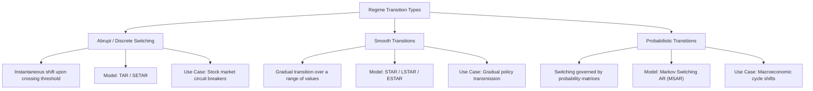

# Ep 51 — Nonlinear Time Series Models

> **Why Lijo watched this**: To understand why linear models (ARIMA) fail to capture complex dynamics, learn the key characteristics of nonlinear time series, and study the concepts of regimes, threshold variables, and transition mechanisms (abrupt, smooth, and probabilistic).

---

## ⏱ Worth watching? WATCH

Verdict: **WATCH**

This lecture is a crucial conceptual entry point into nonlinear time series analysis, which is rarely covered in standard econometrics courses. Focus on **5:20 to 8:10** to understand the core differences in characteristics between linear and nonlinear processes. The most important section is **13:50 to 18:00**, defining the concepts of regimes and threshold variables. Watch **21:00 to 27:35** for the classification of transition mechanisms (abrupt vs. smooth vs. probabilistic switching) and the specific model classes (TAR, STAR, MSAR) that govern them.

---

## What this episode is actually about (ELI12)

Standard time-series models (like ARIMA) are **linear**. They assume that the rules of the game never change. If a stock behaves a certain way when prices are rising, a linear model assumes it behaves the exact same way when prices are crashing. 

In the real world, systems are **nonlinear** and have **regimes** (states). 
Think of water:
*   At $50^\circ\text{C}$, if you heat it up by $1^\circ\text{C}$, it behaves linearly (it just gets slightly warmer).
*   But if you cross a **threshold** at $100^\circ\text{C}$, the state shifts instantly—it boils and turns into steam. The physics (dynamics) of steam are completely different from liquid water.

In economics and finance, we have similar state changes:
1.  **Expansion vs. Recession**: An economy behaves differently when growing than when in a crash.
2.  **High vs. Low Volatility**: Markets exhibit panic states and calm states.

Nonlinear models capture this by dividing the data into regimes using a **threshold variable** (often a past value of the series itself). Within each regime, the model is piece-wise linear (easy to understand), but globally, the model is nonlinear because it switches between these states.

Transitions between states can happen in three ways:
1.  **Abrupt (Discrete)**: You cross a line, and the rules change instantly (e.g., hitting a stop-loss threshold).
2.  **Smooth**: The rules shift gradually over a range (e.g., seasonal weather shifts).
3.  **Probabilistic**: The switch is governed by a roll of the dice based on hidden factors (e.g., shifting between bull and bear markets).

---

## Key Concepts Introduced

- **Linear vs. Nonlinear Processes** — Linear processes are additive and constant over time. Nonlinear processes feature interactive variables, state dependencies, or structural thresholds.
- **Regime / State** — A distinct phase or state of a time series system where the underlying parameters and equations are stable but differ from other phases.
- **Threshold Variable** — A variable (often a lagged observation of the series itself, $Y_{t-d}$) whose value determines which regime the system is currently operating in.
- **Piecewise Linearity** — A model property where the system acts linearly within each individual regime, maintaining local interpretability while achieving global nonlinearity.
- **Abrupt Transition / Discrete Switching** — An instantaneous shift from one regime to another when a threshold condition is met (modeled using Threshold Autoregressive [TAR] models).
- **Smooth Transition** — A gradual transition between regimes over a continuous range of the threshold variable (modeled using Smooth Transition Autoregressive [STAR] models).
- **Probabilistic Transition** — A regime switch governed by probability matrices rather than a hard threshold boundary, typically modeled using hidden variables (e.g., Markov Switching models).

---

## Classification of Regime Transition Mechanisms

---

## Mathematical Intuition of Threshold Models

Let $Y_t$ be a time series. A simple two-regime Threshold Autoregressive (TAR) model with threshold variable $Y_{t-d}$ and threshold value $r$ is written as:

$$Y_t = \begin{cases} 
      \phi_{1,0} + \phi_{1,1} Y_{t-1} + e_{1,t} & \text{if } Y_{t-d} \le r \quad \text{(Regime 1: Low State)} \\
      \phi_{2,0} + \phi_{2,1} Y_{t-1} + e_{2,t} & \text{if } Y_{t-d} > r \quad \text{(Regime 2: High State)}
   \end{cases}$$

Where:
-   $r$ is the threshold level.
-   $d$ is the delay parameter (determining which past lag acts as the switch).
-   Each regime has its own intercept ($\phi_{i,0}$) and lag coefficients ($\phi_{i,1}$), meaning the time series behaves as two completely different AR processes depending on the value of $Y_{t-d}$.

---

## So what for SachNetra?

- **Experiments**:
  - **Add Exp 41: Multi-Regime Volatility Threshold Modeling for Event-Driven Strategy Execution** - Model daily asset returns around earnings announcements as a Threshold Autoregressive (TAR) process. Define the threshold variable as the size of the earnings surprise. If the surprise is below the threshold, execute a mean-reverting strategy (Regime 1); if it crosses above the threshold, execute a momentum breakout strategy (Regime 2).
- **Verdict**: **Pursue** - Markets respond nonlinearly to information shocks. Segmenting executions into discrete regimes based on surprise thresholds prevents trying to trade trending breakouts with mean-reverting algorithms.

---

## Open questions

- How do we statistically determine the optimal threshold value ($r$) and delay parameter ($d$) from historical training data?
- How do we test the null hypothesis of linearity against the alternative of a threshold model (since the threshold parameter is not identified under the null, creating a "nuisance parameter" problem)?
