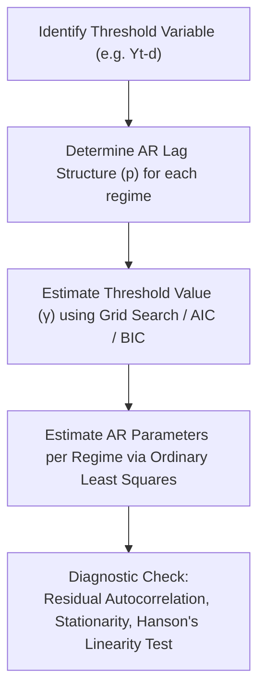

# Ep 52 — Regimes and Nonlinear Models

> **Why Lijo watched this**: To study the mathematical formulations of the three main types of regimes (threshold-based, smooth transition, and latent state-based), understand the advantages and challenges of regime modeling, and learn the formal model structure and estimation steps of the Threshold Autoregressive (TAR) model.

---

## ⏱ Worth watching? WATCH

Verdict: **WATCH**

This lecture provides the formal mathematical representation of regime switching. Focus on **3:20 to 10:20** for the math of the three regime specifications: threshold-based inequalities, the Logistic Smooth Transition function, and the Markov Transition Probability Matrix. The section from **20:00 to 22:40** is also critical, detailing the piecewise AR formulation of the TAR model. Watch **24:30 to 25:40** to understand the "boundary issue" challenge in regime estimation.

---

## What this episode is actually about (ELI12)

If you accept that markets operate in different states (or **regimes**), the next step is writing equations that define how these regimes switch. This lecture breaks down the three mathematical ways to model regime transitions:

1.  **Threshold-Based (Hard Switch)**: Like a thermostat. If the temperature is below $20^\circ\text{C}$, the heater is ON. If it goes above, the heater is OFF. In finance, if the stock return yesterday was less than $-2\%$, we enter the "Panic Regime." If it was above $-2\%$, we stay in the "Normal Regime."
2.  **Smooth Transition (Soft Switch)**: Instead of switching instantly, the system transitions gradually. It uses a **Logistic Function** (a S-shaped curve) that outputs a value between 0 and 1. This represents the percentage transition. It's like going from winter to spring; it doesn't happen in a single day, but rather as a gradual warming process.
3.  **Latent State-Based (Markov Switch)**: You don't see the switch directly. Instead, you model the probability of moving from one hidden state to another. For example, if you are in a Bull market today, there is a $90\%$ chance you remain in it tomorrow, and a $10\%$ chance you switch to a Bear market.

The lecture then zooms into the **Threshold Autoregressive (TAR)** model. A TAR model splits a time series into piecewise sections. Inside the "Calm Regime," it runs a standard AR(1) equation with calm parameters. Inside the "Crisis Regime," it runs an AR(2) equation with volatile parameters. Globally, the model is nonlinear because it jumps between these two equations.

---

## Key Concepts Introduced

- **Threshold-Based Regime** — A state division governed by checking whether a lagged variable $Y_{t-d}$ is strictly less than or greater than a threshold value $\gamma$.
- **Smooth Transition Regime** — A state transition governed by a continuous function (e.g. logistic function) that yields a value between 0 and 1, representing a gradual transition.
- **Slope Parameter ($\gamma$)** — In smooth transition models, the parameter that determines the speed and sharpness of the transition between states.
- **Latent State-Based Regime** — A regime division where states are hidden, and the switching is governed by transition probabilities.
- **Markov Transition Matrix ($P$)** — A matrix containing the probabilities $p_{ij}$ of transitioning from state $i$ to state $j$ at the next time step.
- **Boundary Issues** — An estimation challenge in TAR models where having too few data points close to the threshold boundary makes parameter estimation unstable.

---

## Mathematical Formulations

### 1. Mathematical Formulations of Regimes

#### A. Threshold-Based (2 Regimes)
*   **Regime 1**: Operating if $Y_{t-d} \le \gamma$ (threshold value $\gamma$, delay $d$).
*   **Regime 2**: Operating if $Y_{t-d} > \gamma$.

#### B. Smooth Transition (STAR)
The transition is governed by the continuous function $G(z_{t-d}; \gamma, c) \in [0, 1]$:
$$G(z_{t-d}; \gamma, c) = \frac{1}{1 + e^{-\gamma (z_{t-d} - c)}}$$
Where:
-   $z_{t-d}$ is the transition variable.
-   $c$ is the threshold value (the midpoint of the transition).
-   $\gamma$ is the slope parameter (governing the speed/steepness of transition).

#### C. Latent State-Based (Markov Switching)
Transitions are governed by the Transition Matrix $P$:
$$P = \begin{pmatrix} p_{11} & p_{12} \\ p_{21} & p_{22} \end{pmatrix}$$
Where $p_{ij} = \Pr(\text{State}_t = j \mid \text{State}_{t-1} = i)$ is the transition probability.

---

### 2. Threshold Autoregressive (TAR) Model Structure
For a two-regime TAR model of AR order $p$ and delay $d$:

$$Y_t = \begin{cases}
      \phi_{1,0} + \phi_{1,1} Y_{t-1} + \dots + \phi_{1,p} Y_{t-p} + e_t & \text{if } Y_{t-d} \le \gamma \quad \text{(Regime 1)} \\
      \phi_{2,0} + \phi_{2,1} Y_{t-1} + \dots + \phi_{2,p} Y_{t-p} + e_t & \text{if } Y_{t-d} > \gamma \quad \text{(Regime 2)}
   \end{cases}$$

Where $\phi_{i,j}$ represents the AR coefficient for regime $i$ at lag $j$.

---

### 3. Steps in TAR Model Building

---

## So what for SachNetra?

- **Experiments**:
  - **Add Exp 42: LSTAR vs. Abrupt TAR for Event-Driven Volatility Transition Modeling** - Compare an abrupt TAR model (which assumes instant regime changes) against a Logistic Smooth Transition Autoregressive (LSTAR) model. Test on returns around major regulatory filing events to measure which model class provides more accurate out-of-sample volatility forecasts and lower prediction error.
- **Verdict**: **Pursue** - Modeling market transitions as smooth rather than abrupt is often more realistic, as institutional flow and retail response diffuse gradually through the order book post-event.

---

## Open questions

- How do we calculate the transition probabilities in a Markov Switching model when states are completely unobserved?
- In LSTAR models, how do we estimate the slope parameter $\gamma$ accurately when the transition is extremely steep?
