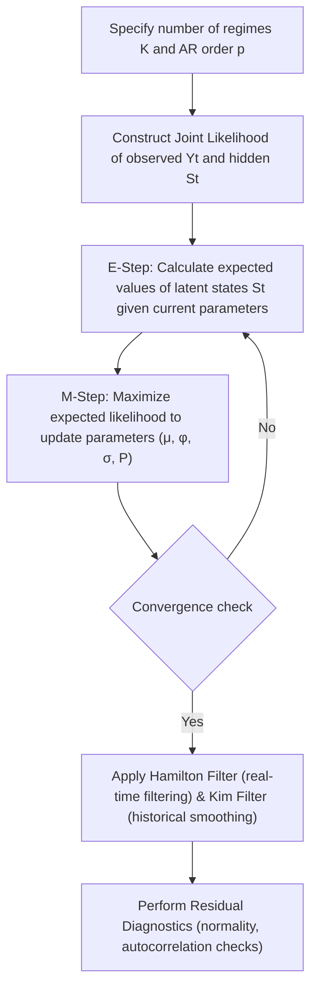

# Ep 54 — Markov Switching Models

> **Why Lijo watched this**: To understand the mathematical structure of Markov Switching Models (MSMs), how they differ from threshold-based models (TAR/STAR), how parameters and latent states are estimated, and explore theoretical extensions like bilinear and NARX models.

---

## ⏱ Worth watching? WATCH

Verdict: **WATCH**

This lecture covers the theoretical foundation of Markov switching and filters/smoothers. Focus on **4:30 to 6:45** for the core distinction between MSMs (probabilistic, unobservable/latent states) and TAR/STAR models (observable variables/thresholds). Watch **9:30 to 14:00** for the mathematical formulation of the Markov Switching Autoregressive (MS-AR) model and the row-sum property of the transition matrix. Watch **15:00 to 16:30** to understand the EM algorithm, Hamilton filter, and Kim filter estimation steps.

---

## What this episode is actually about (ELI12)

Imagine you are looking at a stock price that sometimes goes up and down slowly (low volatility) and sometimes swings wildly (high volatility). In models like TAR, we say: "if yesterday's return crashed below $-2\%$, switch to the wild state." That is a rule based on something we can see directly.

But in a **Markov Switching Model (MSM)**, we assume the true state of the market is a *secret* hidden from us. We don't see the switch directly. Instead, we model the *probability* of the market switching from one hidden state to another. For example, if the market is currently in a quiet state, there is a $90\%$ chance it stays quiet tomorrow, and a $10\%$ chance it switches to the wild state. If it's in the wild state, there is an $80\%$ chance it stays wild, and a $20\%$ chance it goes back to quiet. 

Because we cannot see the state directly, we use special math filters (like the **Hamilton Filter** and **Kim Filter**) to look at the prices and work backward to figure out the most likely state the market was in at any given moment.

---

## Key concepts introduced

- **Markov Switching Model (MSM)** — A nonlinear model where transitions between different regimes are governed by a hidden, first-order Markov chain. Matters because it allows regime switching to occur probabilistically rather than relying on arbitrary, hard-coded observable thresholds.
- **Latent State ($S_t$)** — An unobservable state variable that represents the active regime at time $t$. Matters because it captures underlying structural shifts in the system that are not directly visible in the raw time-series observations.
- **First-Order Markov Property** — The assumption that the probability of being in a state today depends only on the state yesterday. Matters because it makes the mathematics of switching probabilities tractable and stable.
- **Hamilton Filter** — An estimation algorithm that computes the probability of being in a particular state at time $t$ using data up to time $t$. Matters because it allows real-time inference of hidden regimes.
- **Kim Filter** — A smoothing algorithm that refines the state probabilities at time $t$ by utilizing the entire sample (both past and future data relative to $t$). Matters because it provides a cleaner, historical view of regime changes.
- **Bilinear Model** — A model that incorporates products of past observations and past noise terms. Matters because it captures complex interaction effects between shocks and historical levels in a time series.
- **Nonlinear ARX (NARX)** — An auto-regressive model with exogenous inputs where the relationship is modeled via a nonlinear function (like a neural network). Matters because it integrates external explanatory variables into a flexible nonlinear time-series framework.

---

## Mathematical Formulations

### 1. Markov Switching Autoregressive (MS-AR) Model
For a process with $K$ regimes and AR order $p$:

$$Y_t = \mu_{S_t} + \phi_{S_t, 1} Y_{t-1} + \dots + \phi_{S_t, p} Y_{t-p} + e_t$$

Where:
- $S_t \in \{1, \dots, K\}$ is the hidden state at time $t$.
- $\mu_{S_t}$ is the regime-dependent mean.
- $\phi_{S_t, i}$ are the regime-dependent AR coefficients.
- $e_t \sim N(0, \sigma^2_{S_t})$ is the error term with regime-dependent variance.

---

### 2. State Transition Probability Matrix
The transitions between the $K$ latent states are governed by the $K \times K$ matrix $P$:

$$P = \begin{pmatrix} 
p_{11} & p_{12} & \dots & p_{1K} \\
p_{21} & p_{22} & \dots & p_{2K} \\
\vdots & \vdots & \ddots & \vdots \\
p_{K1} & p_{K2} & \dots & p_{KK}
\end{pmatrix}$$

Where:
- $p_{ij} = \Pr(S_t = j \mid S_{t-1} = i)$ is the probability of transitioning from state $i$ to state $j$.
- For every row $i$, the probabilities must sum to 1: $\sum_{j=1}^K p_{ij} = 1$.

---

### 3. Model Estimation Workflow
Since states $S_t$ are unobservable, estimation cannot be done via simple OLS. Instead, the workflow follows:

---

### 4. Numerical Example (2-Regime MS-AR)
Simulated with $N=300$ observations, true parameters, and estimated outputs:

| Parameter | True Value | Estimated Value (Regime 1) | Estimated Value (Regime 2) |
| :--- | :---: | :---: | :---: |
| **Mean ($\mu$)** | $[1.0, -1.0]$ | $0.98$ | $-1.02$ |
| **AR Coefficient ($\phi_1$)** | $[0.8, 0.5]$ | $0.81$ | $0.48$ |
| **Std Dev ($\sigma$)** | $[0.5, 1.0]$ | $0.52$ | $1.05$ |
| **Transition Probability ($p_{i1}$)** | $p_{11}=0.9, p_{21}=0.2$ | $p_{11}=0.89$ | $p_{21}=0.19$ |
| **Transition Probability ($p_{i2}$)** | $p_{12}=0.1, p_{22}=0.8$ | $p_{12}=0.11$ | $p_{22}=0.81$ |

*Note: The row sum constraint is preserved in estimation (e.g. $0.89 + 0.11 = 1.0$ and $0.19 + 0.81 = 1.0$).*

---

## So what for SachNetra?

- **Experiments**:
  - **Add Exp 44: Hidden Markov Switching AR vs. Volatility-Threshold GARCH for Post-Filing Drift Regime Classification** - Compare a 2-regime Markov Switching Autoregressive (MS-AR) model (where the volatility regime is latent) against an observable threshold GARCH model. Test on post-filing return data to determine whether modeling regimes probabilistically improves drift classification accuracy and reduces false trading signals.
- **Verdict**: **Pursue** - Market regimes post-earnings are rarely clean, observable thresholds; they are driven by unobserved institutional liquidity provisioning. Modeling these regimes as latent Markov states is theoretically superior.

---

## Open questions

- How computationally expensive is the Hamilton/Kim filter algorithm when expanding from a 2-regime model to a multi-regime ($K > 3$) model?
- Can we utilize deep-learning based hidden state estimation (like LSTM or transformer attention weights) as a non-parametric alternative to the transition matrix $P$?
