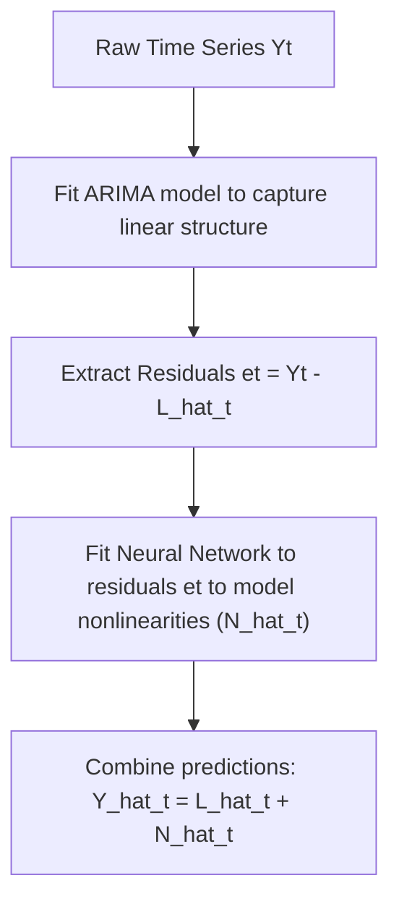

# Ep 56 — Machine Learning in Time Series

> **Why Lijo watched this**: To obtain a high-level taxonomy of machine learning and deep learning applications in time-series forecasting, understand feature engineering (turning sequential data into tabular data), and evaluate hybrid statistical-ML approaches.

---

## ⏱ Worth watching? SKIM

Verdict: **SKIM**

This lecture is a broad introductory survey of machine learning in time series. Watch **3:50 to 5:30** to understand the "blackbox" nature of ML and how explainability is traded for pattern-recognition power. Watch **6:30 to 9:00** for the core conceptual process of "feature engineering" (converting raw $Y_t$ into tabular lagged/rolling features). The rest is a catalog of models (random forests, LSTM, CNN, hybrids, Prophet, etc.) that can be skimmed unless you need a refresher on basic ML vocabulary.

---

## What this episode is actually about (ELI12)

So far in this course, we used traditional math models (like ARIMA) where we can write the exact rules of a time series on a piece of paper. But what if the data has highly complex, messy patterns that simple formulas cannot capture?

This is where **Machine Learning (ML)** comes in. ML acts like a "black box": you feed it inputs (like past prices), and it gives you predictions, but the math inside the box is too complex to write down simply.

To use classical ML algorithms, we must first translate a sequence of values (a single line of data) into a table of features. We do this by creating columns of:
1.  **Lags**: What was the price yesterday, two days ago, or three days ago?
2.  **Rolling Statistics**: What was the average price or standard deviation over the last week?
3.  **Fourier Transforms**: Columns representing cyclical ups and downs.

The lecture then lists different tools in the ML toolbox: classical models (like linear regression, random forests, and SVMs), deep learning models (like LSTMs, CNNs, and Transformers), and **Hybrid Models** which combine explainable formulas (like ARIMA) with neural networks to clean up the residual errors.

---

## Key concepts introduced

- **Blackbox Model** — A model where the internal decision-making process is highly complex and not easily explainable, representing a direct trade-off between parsimony/interpretability and prediction accuracy. Matters because it contrasts with traditional "white box" statistical models like ARIMA.
- **Feature Engineering** — The process of transforming a raw sequential time series into a tabular dataset containing independent variables (features) for ML training. Matters because classical ML models cannot naturally digest sequential order without this translation.
- **Lagged Features** — Using past observations ($Y_{t-1}, Y_{t-2}$) as independent input columns to predict the current value $Y_t$. Matters because it is the primary way to inject memory into tabular ML models.
- **Hybrid Time-Series Models** — An approach that combines explainable statistical models (e.g. ARIMA) with deep learning (e.g. RNNs). Matters because the statistical model captures linear trends and seasonal structures, while the neural network models the complex nonlinear residuals.
- **Long Short-Term Memory (LSTM)** — A type of Recurrent Neural Network (RNN) designed to learn long-term sequential dependencies without suffering from vanishing gradients. Matters because it preserves historical memory across long sequences.
- **Temporal Fusion Transformer (TFT)** — A specialized deep learning architecture that combines self-attention mechanisms with interpretable components to perform multi-horizon forecasting. Matters because it bridges the gap between neural network power and feature importance explainability.
- **Bayesian Structural Time Series (BSTS)** — A state-space framework that decomposes time series into trend, seasonality, and regression components using Bayesian priors. Matters because it incorporates uncertainty estimation into forecasts.

---

## Feature Engineering and Model Architectures

### 1. Converting Sequential Data to Tabular Format
To train a supervised ML model (like Random Forest or XGBoost) on time series $Y = \{y_1, y_2, \dots, y_n\}$, we construct a design matrix (features) and target vector:

$$\begin{array}{ccc|c}
\text{Feature 1 (Lag 1)} & \text{Feature 2 (Lag 2)} & \text{Feature 3 (Rolling Mean 3)} & \text{Target (Y_t)} \\
\hline
y_{t-1} & y_{t-2} & \frac{y_{t-1} + y_{t-2} + y_{t-3}}{3} & y_t \\
y_{t} & y_{t-1} & \frac{y_{t} + y_{t-1} + y_{t-2}}{3} & y_{t+1} \\
\end{array}$$

---

### 2. Hybrid Model Formulation (ARIMA + Neural Network)
The time series $Y_t$ is decomposed into a linear component $L_t$ and a nonlinear component $N_t$:

$$Y_t = L_t + N_t$$

The modeling workflow is as follows:

---

### 3. Machine Learning Taxonomy for Time Series

| Model Category | Key Algorithms | Best Suited For | Explainability |
| :--- | :--- | :--- | :--- |
| **Classical ML** | Linear Regression, SVM, Random Forest, XGBoost | Short-term forecasting with engineered lag/rolling features | Medium (via Feature Importance / SHAP) |
| **Deep Learning** | LSTM, GRU, CNN, Transformers (TST) | Large datasets with complex, long-range sequential dependencies | Low (Blackbox) |
| **Specialized/Business**| Facebook Prophet, N-BEATS, TFT | Business forecasting with holidays, multiple seasonalities, and trend shifts | High (Prophet/TFT) |
| **Probabilistic** | Gaussian Processes, BSTS | Small datasets where risk management and uncertainty bands are critical | High (BSTS) |

---

## So what for SachNetra?

- **Experiments**:
  - **Add Exp 45: Hybrid ARIMA-LSTM Residual Modeling for Post-Earnings Drift Tracking** - Fit a base SARIMAX model to capture linear drift patterns and day-of-week seasonality in post-event returns. Pass the residuals of the SARIMAX model to an LSTM to capture transient, nonlinear pricing patterns. Evaluate whether the hybrid model outperforms standard SARIMAX on directional accuracy.
- **Verdict**: **Pursue** - Hybrid models are highly practical because they allow us to keep the robust, statistically sound linear part of our signal (ARIMA) while letting a simple neural network clean up the complex residual noise.

---

## Open questions

- How do we prevent lookahead bias when constructing rolling statistical features in historical backtests?
- When building Hybrid ARIMA-Neural Network models, does fitting the models sequentially lead to sub-optimal parameter estimation compared to joint estimation?
