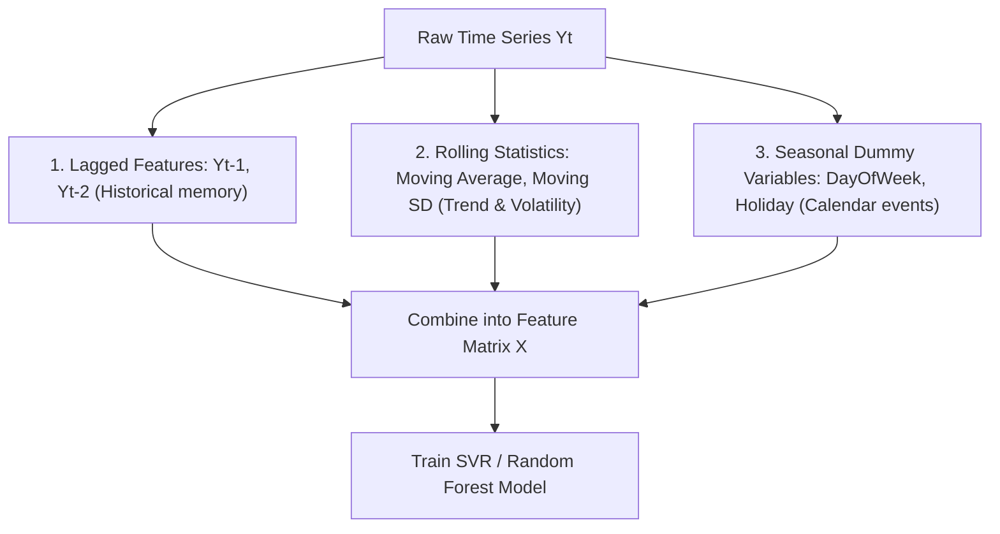

# Ep 57 — Linear Regression for Time Series and Beyond

> **Why Lijo watched this**: To examine the formal integration of linear regression, support vector regression (SVR), and random forests in time series, study the main feature engineering classes (lags, rolling statistics, seasonality indicators), and contrast their trade-offs.

---

## ⏱ Worth watching? WATCH

Verdict: **WATCH**

This lecture details how classical ML algorithms are modified for time series data. Focus on **8:50 to 13:50** to master the three feature engineering categories (lagged features, rolling statistics like moving averages/stdevs, and seasonality dummy variable encoding). Watch **19:25 to 22:30** to understand how Support Vector Regression (SVR) uses a margin of tolerance ($\epsilon$) and kernel tricks (like RBF) for nonlinear regression. The comparative table at **27:30 to 29:00** is also an excellent summary of trade-offs.

---

## What this episode is actually about (ELI12)

If we want to use standard machine learning tools for time series, we have to prepare the data in a very specific way. This is called **Feature Engineering**, and it splits our dataset into three main types of inputs:
1.  **Lags**: What happened yesterday or the day before? (e.g. yesterday's temperature).
2.  **Rolling Statistics**: What is the average or standard deviation over a sliding window? (e.g. average price of the last 7 days).
3.  **Seasonality Indicators**: Yes/no questions turned into ones and zeros (e.g. Is today a holiday? Is today a Monday?).

Once the table is ready, we can run three popular models:
*   **Linear Regression**: Draws a straight line through the data. It is super fast and easy to explain, but it breaks if the patterns are curved (nonlinear) or if different inputs are too similar to each other (multicollinearity).
*   **Support Vector Regression (SVR)**: Fits the data within a "tube" of tolerance. Points inside the tube are ignored, and points outside are penalized. By using "kernels," it can warp the data space to fit complex curves.
*   **Random Forest**: Combines hundreds of different decision trees (flowcharts of rules) and averages their answers. It is excellent at catching curves and interactions without needing scaled data, but it cannot predict values higher or lower than anything it has seen before (struggles with extrapolation).

---

## Key concepts introduced

- **Feature Engineering** — The curation and transformation of sequential data into meaningful input columns (features) for a machine learning model. Matters because the accuracy of classical ML models depends entirely on feature design.
- **Multicollinearity** — A condition where two or more independent features in a regression model are highly correlated. Matters because it makes linear regression coefficients unstable and highly sensitive to small changes in data.
- **Support Vector Regression (SVR)** — An adaptation of Support Vector Machines that fits a regression model within an $\epsilon$-insensitive margin of tolerance. Matters because it optimizes the model to ignore errors below a threshold, increasing robustness to noise.
- **Kernel Trick** — A mathematical method that projects data into a higher-dimensional space where nonlinear relationships become linearly separable. Matters because it allows SVR to handle complex curves using linear math.
- **Random Forest Regression** — An ensemble method that trains multiple decision trees on random bootstrap samples of data and averages their predictions. Matters because it models highly complex interactions naturally without requiring data scaling.
- **Extrapolation Limit** — The inability of tree-based models (like Random Forests) to forecast values outside the range of their training data. Matters because it means a Random Forest can never predict a new all-time high or all-time low.

---

## Mathematical Formulations & Comparative Framework

### 1. Support Vector Regression (SVR) Objective Function
SVR finds a function $f(x) = \langle w, x \rangle + b$ that has at most $\epsilon$ deviation from the actual targets $y_i$, while remaining as flat as possible. This is formulated as:

$$\min_{w, b, \xi, \xi^*} \frac{1}{2} \|w\|^2 + C \sum_{i=1}^n (\xi_i + \xi_i^*)$$

Subject to:
$$y_i - \langle w, x_i \rangle - b \le \epsilon + \xi_i$$
$$\langle w, x_i \rangle + b - y_i \le \epsilon + \xi_i^*$$
$$\xi_i, \xi_i^* \ge 0$$

Where:
- $C$ is the regularization parameter (trade-off between flatness and violating the $\epsilon$-tube).
- $\xi_i, \xi_i^*$ are slack variables representing deviations outside the $\epsilon$-tube.
- $\epsilon$ is the margin of tolerance where no penalty is given.

---

### 2. Feature Engineering Construction

---

### 3. Model Comparison Table

| Property | Linear Regression | Support Vector Regression (SVR) | Random Forest |
| :--- | :--- | :--- | :--- |
| **Complexity** | Low | Medium to High | Medium |
| **Interpretability** | High (Coefficients) | Medium (Dual representation) | Low to Medium (Feature Importance) |
| **Nonlinearity** | None | Excellent (via Kernels) | Excellent (Piece-wise constant) |
| **Feature Scaling** | Not required | **Critical** (MinMax / Z-score) | Not required |
| **Computational Cost**| Low | High (Quadratic with sample size) | Medium |
| **Extrapolation** | Yes (Linear trend projected) | Yes (Linear kernel only) | **No** (Struggles with trend growth) |

---

## So what for SachNetra?

- **Experiments**:
  - **Add Exp 46: SVR with RBF Kernel vs. Random Forest for Intraday Event Spread Extrapolation** - Train an SVR with a Radial Basis Function (RBF) kernel and a Random Forest on event-driven spread deviations. Test on simulated breakout data to measure which model handles extrapolation better when spreads widen past historical training bounds.
- **Verdict**: **Pursue** - SVR is structurally superior to Random Forest for predicting price breakouts because Random Forest cannot extrapolate beyond historical extreme values.

---

## Open questions

- How does the performance of SVR degrade when features suffer from severe multicollinearity?
- What is the most effective kernel selection method for highly cyclical (seasonal) financial time-series data?
