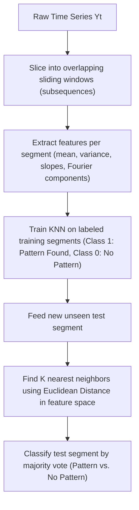

# Ep 58 — Other Machine Learning Models for Time Series

> **Why Lijo watched this**: To study the implementation of K-Nearest Neighbors (KNN) for time-series forecasting and pattern recognition, understand Naive Bayes classification on sequential data, and analyze distance-based vs. probabilistic classification trade-offs.

---

## ⏱ Worth watching? WATCH

Verdict: **WATCH**

This lecture details the mechanics of distance-based time series modeling. Focus on **7:15 to 11:00** for the mathematical workflow of converting a univariate series into a supervised $P$-dimensional lag space, and computing Euclidean distance similarity measures. Watch **20:20 to 24:50** for the step-by-step pattern recognition workflow (defining a reference shape, sliding windows, and segment classification). Skim the Naive Bayes section from **25:30 onwards** unless you need a basic refresher on conditional independence assumptions.

---

## What this episode is actually about (ELI12)

This lecture covers two different machine learning models that help us find patterns and classify data:

1.  **K-Nearest Neighbors (KNN)**: 
    Think of this as "matching historical shapes." If we want to predict what happens next, the model searches our history to find the $K$ times (neighbors) when the price movements looked most similar to today. 
    *   To do this, we measure the distance (usually straight-line **Euclidean distance**) between today's lag pattern and all historical lag patterns.
    *   If it is a forecasting (regression) problem, we take the average of what happened next in those $K$ matches.
    *   If it is a classification problem, we take the most common next direction (majority vote).
    *   We can also use this for **Pattern Recognition**, where we slice the series into short windows and use KNN to find shapes like "head-and-shoulders" or spikes.

2.  **Naive Bayes**: 
    A simple probability calculator. It asks: "Given yesterday's return and the day before, what is the probability that today is a crash day?" To make the math simple, it make the "naive" assumption that yesterday's return has no correlation with the day before's return (conditional independence). While this assumption is usually wrong in time series, the model is incredibly fast and works well for simple classifications (like normal vs. anomaly).

---

## Key concepts introduced

- **K-Nearest Neighbors (KNN) Forecasting** — A non-parametric method that forecasts future values by averaging the outcomes of the $K$ most similar historical subsequences. Matters because it does not assume any functional form (like linear or polynomial) for the data.
- **Euclidean Distance Measure** — The straight-line distance between two vectors in a $P$-dimensional lag space. Matters because it is the primary metric used to determine segment similarity in KNN.
- **Curse of Dimensionality** — The phenomenon where distance metrics become less informative as the number of dimensions (e.g. number of lag features $P$) increases, making all points seem equidistant. Matters because it requires careful pruning of lag features.
- **Lazy Learner** — An algorithm (like KNN) that does not train an explicit parametric model during the training phase, but instead stores the raw training data and performs all computations at prediction time. Matters because it is computationally expensive to query in real time on large datasets.
- **Pattern Recognition (Time Series)** — The process of identifying subsequences in a time series that match a pre-defined reference shape (e.g. chart patterns, cardiac arrhythmias). Matters because it automates structural pattern searches.
- **Naive Bayes Classifier** — A probabilistic classifier based on Bayes' Theorem that assumes conditional independence among features. Matters because it provides a fast, probabilistic baseline for sequence classification.
- **Conditional Independence Assumption** — The naive assumption that the value of lag feature $Y_{t-1}$ is independent of $Y_{t-2}$ given the class label. Matters because this assumption is heavily violated in autocorrelated time series, often degrading Naive Bayes' probability calibration.

---

## Algorithms and Workflows

### 1. KNN Distance and Prediction Formulation
Given a test query vector of lags $X^* = [y^*_{t-1}, y^*_{t-2}, \dots, y^*_{t-p}]$ and training vectors $X_i = [y_{i-1}, y_{i-2}, \dots, y_{i-p}]$:

#### Step A: Compute Euclidean Distance to all training instances $i$
$$d(X^*, X_i) = \sqrt{\sum_{j=1}^p (y^*_{t-j} - y_{i-j})^2}$$

#### Step B: Select the set $N_k(X^*)$ containing the indices of the $K$ smallest distances.

#### Step C: Compute Forecast Prediction $\hat{y}_t$
*   **For Regression**: $\hat{y}_t = \frac{1}{K} \sum_{i \in N_k(X^*)} y_i$
*   **For Classification**: $\hat{y}_t = \arg\max_{c} \sum_{i \in N_k(X^*)} I(y_i == c)$

---

### 2. Time-Series Pattern Recognition Workflow

---

### 3. Naive Bayes Classification
To classify a time-series segment into class $C_k$ (e.g., $C_0 = \text{Normal}$, $C_1 = \text{Anomalous}$) based on lag features $x_1, \dots, x_p$:

$$\Pr(C_k \mid x_1, \dots, x_p) \propto \Pr(C_k) \prod_{j=1}^p \Pr(x_j \mid C_k)$$

*Note: The product term assumes conditional independence of lags, which ignores the serial correlation (autocorrelation) structure.*

---

## So what for SachNetra?

- **Experiments**:
  - **Add Exp 47: KNN-Based Chart Pattern Matching vs. Heuristic Rule Engines** - Implement a KNN classifier that searches for historical chart patterns (e.g. double bottom or cup-and-handle) in normalized price paths using Euclidean distance. Compare the precision of KNN-based entries against a hardcoded heuristic rule engine on post-filing return data.
- **Verdict**: **Pursue** - Distance-based pattern matching is a highly effective way to identify complex setup structures before corporate announcements, without over-parameterizing the model.

---

## Open questions

- How does Dynamic Time Warping (DTW) perform as a distance metric alternative to Euclidean distance when comparing time series of different speeds or phases?
- Is Naive Bayes practically usable for volatility regime classification, or do the independence assumptions lead to highly inflated confidence intervals?
