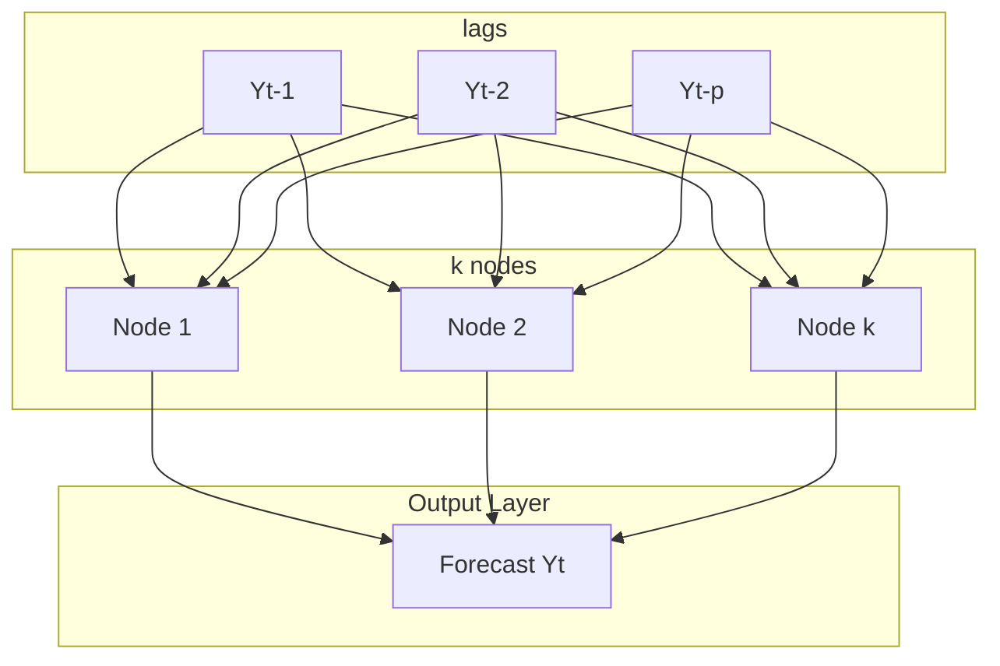

# Ep 59 — Neural Networks for Time Series

> **Why Lijo watched this**: To examine the mathematical foundations of Neural Network Autoregression (NNAR) models, understand perceptron weight adjustments, study sigmoid/tanh activation functions, and analyze the USD/INR exchange rate forecasting case study.

---

## ⏱ Worth watching? WATCH

Verdict: **WATCH**

This lecture covers the formal mathematical transition from linear AR models to Neural Network Autoregression (NNAR). Focus on **11:00 to 13:20** for the perceptron weight adjustment derivative equation and the roles of expected vs. actual outputs. Watch **19:15 to 22:10** for the core NNAR($p, k$) framework and the structural proof that NNAR($p, 0$) is mathematically identical to a linear AR($p$) model. The USD/INR forecasting case study at **25:30 to 28:50** is critical, illustrating how NNAR fits differenced stationary inputs but can produce flat out-of-sample forecasts on random-walk-like asset classes.

---

## What this episode is actually about (ELI12)

This lecture explains how to merge artificial neural networks with time series forecasting:

1.  **The Brain Model (Perceptron)**:
    A perceptron is the simplest neural network unit. It takes multiple inputs (like lagged prices), multiplies each by a "weight" representing its importance, adds them up, and runs the sum through an **Activation Function** (like a S-shaped curve) to produce the final forecast.
    *   To improve, it uses feedback. It compares its forecast ($A$) to the real target ($T$) and adjusts its weights backward.
    *   **Sigmoid** and **Tanh** are functions that warp the outputs into ranges like $[0, 1]$ or $[-1, 1]$ to introduce curves (nonlinearity).

2.  **No Hidden Layers = Simple Regression**:
    If you build a neural network but delete the intermediate processing steps (hidden layers), the model collapses back into a standard linear regression model.

3.  **Neural Network Autoregression (NNAR)**:
    This is an Auto-Regressive model where the inputs are past lags, but they are processed through a hidden layer of nodes. We write this as **NNAR($p, k$)**, where $p$ is the number of lags we use as inputs, and $k$ is the number of processing nodes in the middle. 
    *   If you set $k = 0$ (zero middle nodes), the NNAR($p, 0$) model becomes a standard linear AR($p$) model.
    *   **Ensembling**: Because neural networks start with random weights, we train them multiple times (epochs) and average their forecasts.

4.  **USD/INR Exchange Rate Case Study**:
    We take the USD/INR rate, find it is non-stationary, difference it once to make it stationary, and fit an NNAR(1,1) model. However, because exchange rates behave like a random walk, the neural network ends up forecasting a flat line.

---

## Key concepts introduced

- **Perceptron** — The basic computational neuron of a neural network that maps input vectors to an output via a weighted sum and an activation function. Matters because it represents the fundamental building block of deep learning.
- **Feedforward Network** — A neural network architecture where connections between nodes do not form cycles, and information flows strictly in one direction (inputs $\to$ hidden $\to$ outputs). Matters because it is the base architecture for NNAR modeling.
- **Activation Function** — A mathematical function (such as Sigmoid or Tanh) applied to the weighted sum of inputs at a node. Matters because it introduces the nonlinearity needed to capture complex curves rather than flat lines.
- **Neural Network Autoregression (NNAR)** — A feedforward neural network model that utilizes lagged values of a time series as inputs to model nonlinear auto-regressive relationships. Matters because it generalizes AR models into a nonlinear space.
- **Epoch** — One complete forward and backward pass of the entire training dataset through the neural network. Matters because tuning epochs is critical to avoid underfitting (too few) and overfitting (too many).
- **Ensemble Averaging (NNAR)** — The practice of training multiple neural networks with different random initial weights and averaging their predictions. Matters because it stabilizes neural network forecasts, which are highly sensitive to initial parameters.

---

## Mathematical Formulations & Architecture

### 1. Perceptron Weight Update Equation
During training, weights $w_i$ are updated iteratively using the derivative of the activation function and the output error:

$$w_i \leftarrow w_i + \eta \cdot G'\left(\sum_{j=1}^n w_j x_j\right) \cdot (T - A) \cdot x_i$$

Where:
- $w_i$ is the weight associated with input feature $x_i$.
- $\eta$ is the learning rate (governing the speed of weight adjustment).
- $G'$ is the first derivative of the activation function.
- $T$ is the target (true) value from the training label.
- $A$ is the actual output generated by the network.
- $(T - A)$ represents the network's prediction error.

---

### 2. NNAR(p, k) Architecture and Reduction
For a time series $Y_t$, the NNAR($p, k$) model uses $p$ lagged inputs and $k$ hidden nodes:

$$\text{Inputs: } X_t = [Y_{t-1}, Y_{t-2}, \dots, Y_{t-p}]$$

#### The AR Reduction Proof:
If $k = 0$ (no hidden nodes), the network has a direct linear path from the inputs to the output without any activation functions:

$$Y_t = \beta_0 + \beta_1 Y_{t-1} + \dots + \beta_p Y_{t-p} + e_t$$

Which is mathematically identical to a linear Autoregressive **AR($p$)** model.

---

### 3. Activation Functions

| Function Name | Formula | Range | Zero-Centered? | Primary Use Case |
| :--- | :---: | :---: | :---: | :--- |
| **Sigmoid** | $G(x) = \frac{1}{1 + e^{-x}}$ | $[0, 1]$ | No | Output layer for binary classification |
| **Tanh** | $G(x) = \frac{e^x - e^{-x}}{e^x + e^{-x}}$ | $[-1, 1]$ | **Yes** | Hidden layers to optimize gradient flow |

---

## So what for SachNetra?

- **Experiments**:
  - **Add Exp 48: NNAR(p, k) Volatility Forecasting vs. GARCH(1,1) under Regime Shifts** - Train an NNAR($p, k$) model on differenced historical volatility series and compare its out-of-sample forecasting MSE against a benchmark GARCH(1,1) model. Test specifically during historical market regime shifts to measure if the neural network adapts faster to sudden variance expansions.
- **Verdict**: **Pursue** - NNAR is a highly flexible alternative to GARCH because it does not assume a rigid parametric volatility structure, allowing it to adapt better to structural shifts.

---

## Open questions

- In nnetar() in R, how is the optimal number of lags $p$ selected automatically (e.g., does it use AIC/BIC of a linear AR model as a starting point)?
- Since NNAR models are highly sensitive to scaling, what is the impact of different normalization methods (Z-score vs. MinMax) on NNAR forecasting stability?
