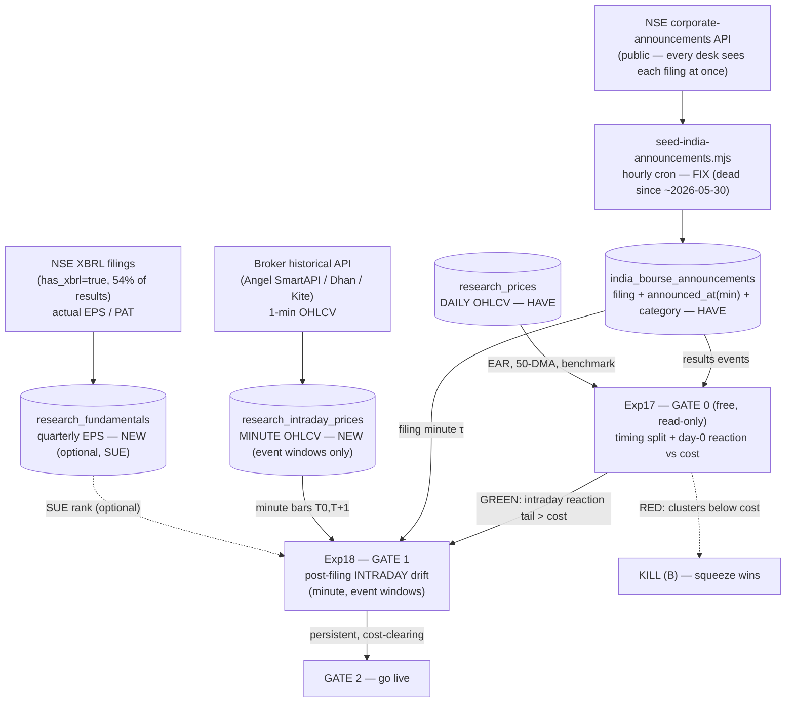
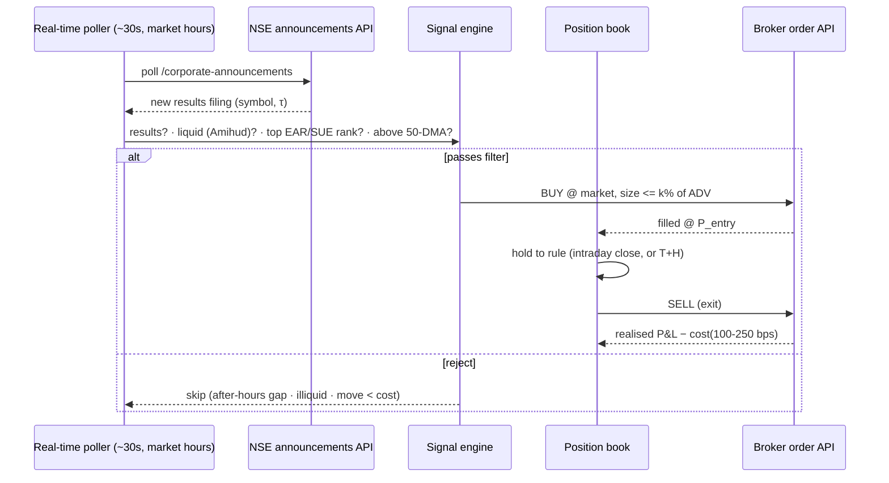

# Mid-Cap Intraday PEAD ("B" — latency capture) — Architecture

> Diagram of the **planned** pipeline for bet (B): capture the intraday drift after a results
> filing on under-covered midcaps. Real table/script names where they exist today; `NEW` marks
> what a green-lit gate would add. **Nothing past Gate 0 is built** — each stage is gated on the
> previous one paying off (Exp16 discipline: don't build a collector for a leg until a pilot says
> we need it).

## What data, from where (answers: minute data? company data?)

| Data | Source | State | Used by |
|---|---|---|---|
| Filing event + `announced_at` (minute) + category | NSE corporate-announcements API | HAVE (`india_bourse_announcements`, 2024-05→) | all gates |
| Daily OHLCV | research_prices (Yahoo backfill) | HAVE (2009→) | Gate 0 |
| **Minute OHLCV** | Broker hist. API (Angel SmartAPI free / Dhan / Kite ₹) | **NEW — `research_intraday_prices`**, event-window days only (~2yr ⇒ cheap) | Gate 1+ |
| **Quarterly EPS/PAT** (for SUE selection) | NSE **XBRL** filings (`has_xbrl=true`, 54%) | **NEW — `research_fundamentals`**, no OCR | selection (optional) |

Universe = liquid half of Nifty Midcap-150 (Amihud-liquid ~75). We backfill minute bars **only for
event-window dates**, not the whole universe continuously — and announcements only span 2024-05→, so
~2 years of intraday history (which free broker APIs cover) is enough.

## Diagram 1 — Data gathering + research gates (Gate 0 → Gate 1)



## Diagram 2 — Live execution (Gate 2 — only if Gate 1 proves it)



## Formulas (carried on the arrows above)

```
Abnormal return:         AR = r_stock − r_benchmark
(B) intraday drift:      (P_close(T0) − P_τ)/P_τ − bench   ; τ = filing minute, measured AFTER first pop
Time-series SUE:         Expected_EPS_q = EPS_(q−4) + mean(EPS_q − EPS_(q−4))
                         SUE = (Actual_EPS_q − Expected_EPS_q) / σ(past surprises)
Tradability:             NetCAR = grossCAR − cost(100–250 bps) ;  position ≤ k%·ADV
Gates (= Exp16):         NetCAR>0 @250bps · DSR≥0.95 · Theil U<1 · ADF p<.05 & KPSS ok
```

## The honest constraints (why every stage is gated)
- **Public feed:** NSE's API is seen by all desks at once → (B) is NOT "be first to the move"; it's
  "does intraday drift persist after the fast money's pop?" (intraday PEAD). Gate 1 tests exactly that.
- **The squeeze (Exp10):** long lead ⇒ small move. Gate 0 checks whether the reaction even clears cost
  before we spend on minute data.
- **Only ~1/3 of filings are intraday** (33.2% in 09:15–15:30; 66% file after-close = un-raceable gap).
- **Fix the cron first** — a live (B) needs a real-time feed; right now the hourly one is dead.
```
