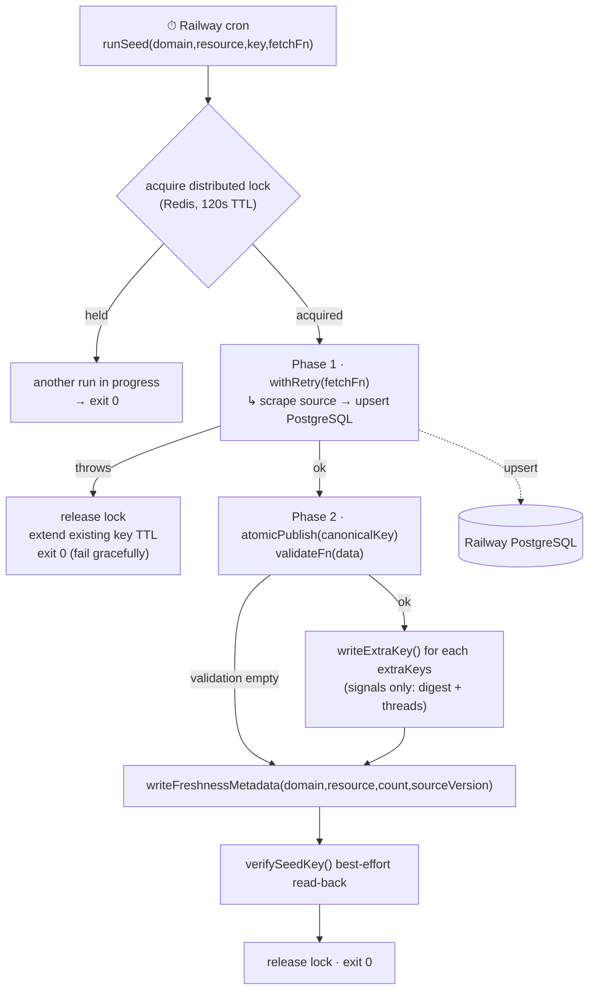
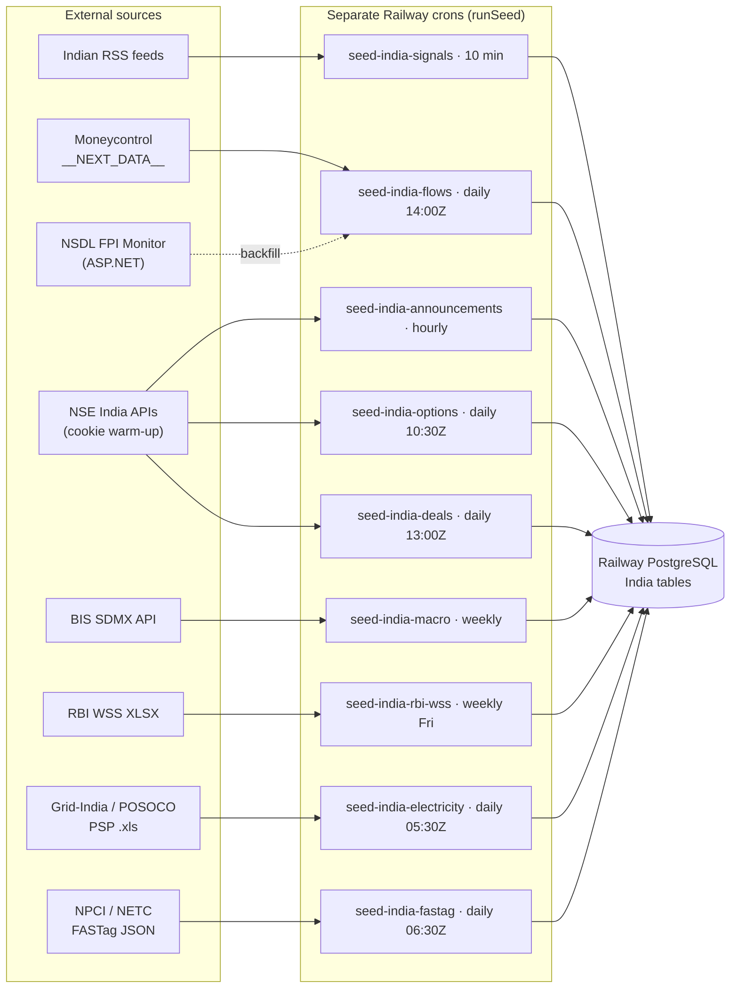
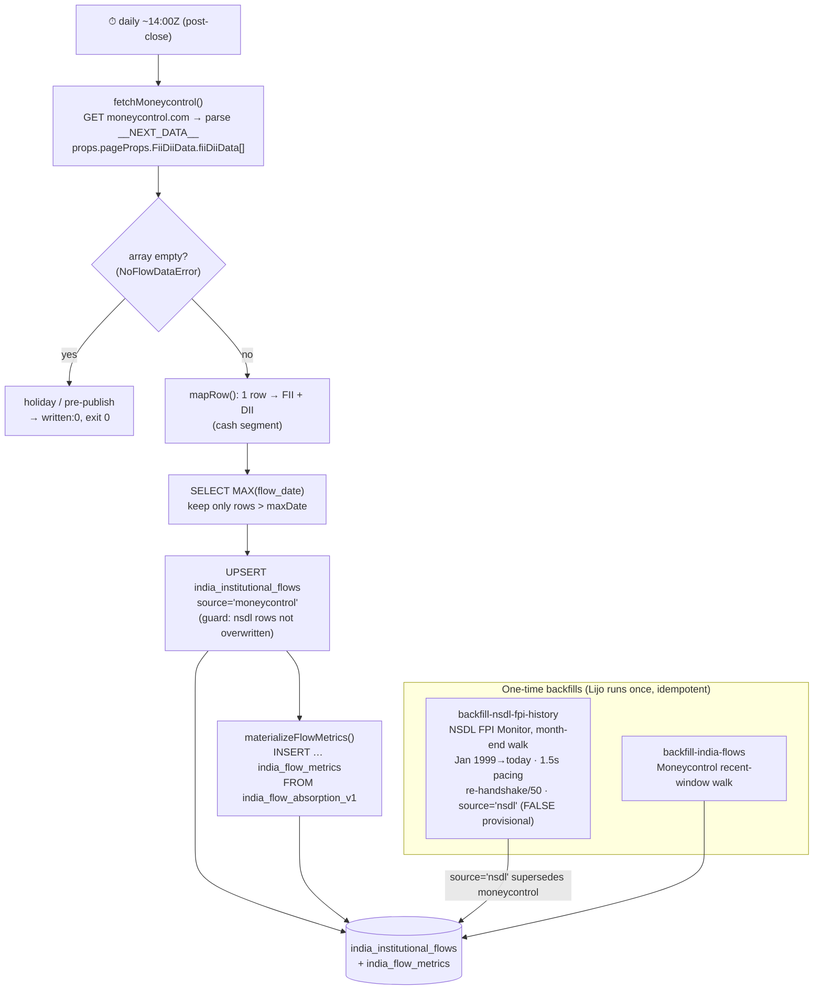
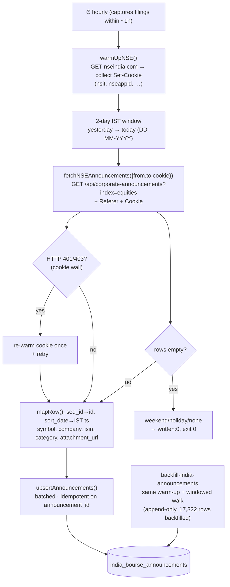
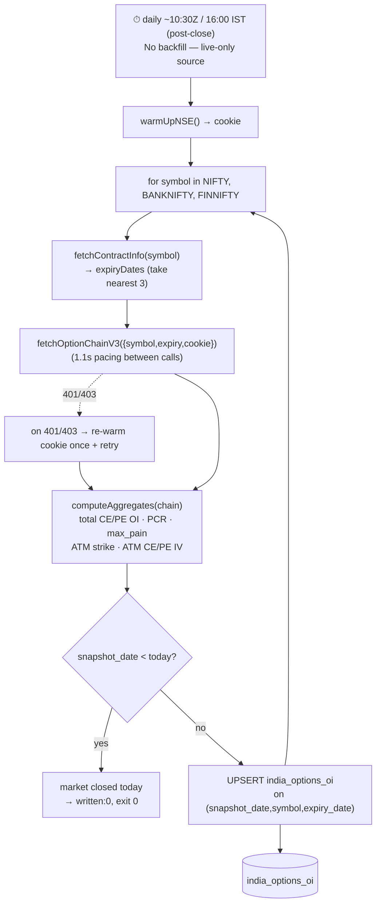
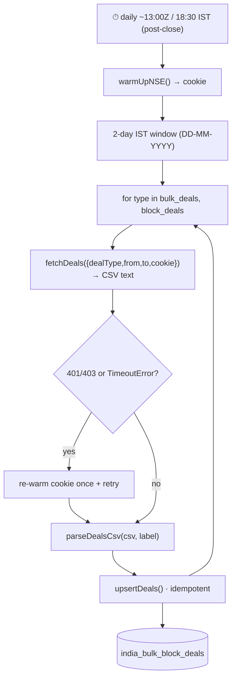
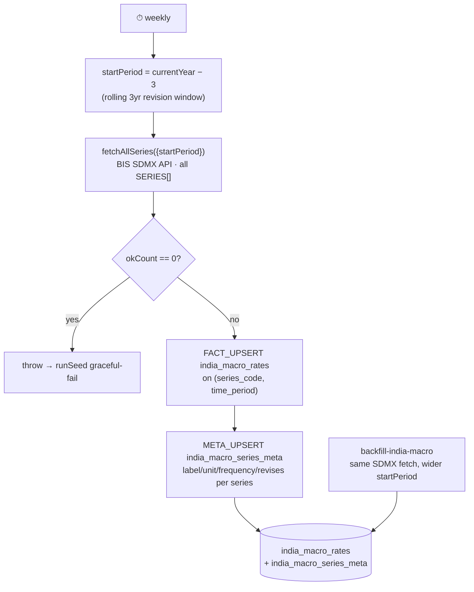
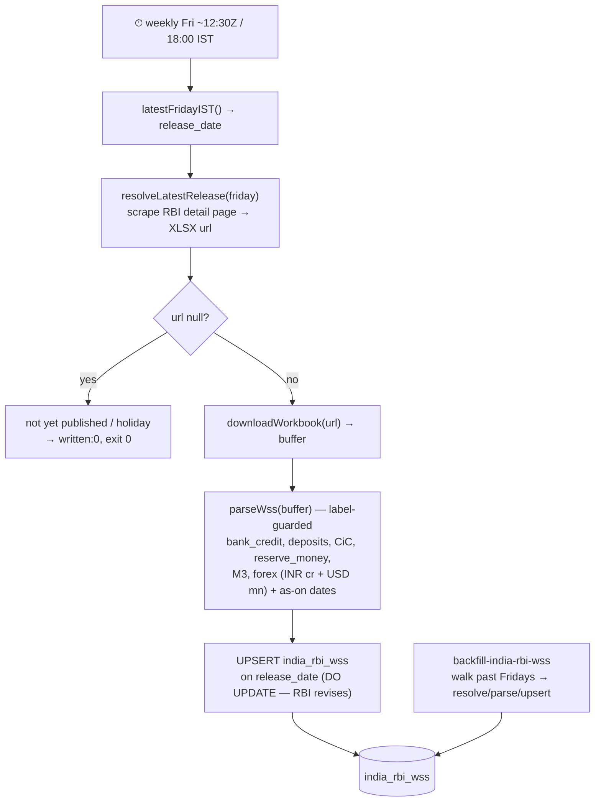
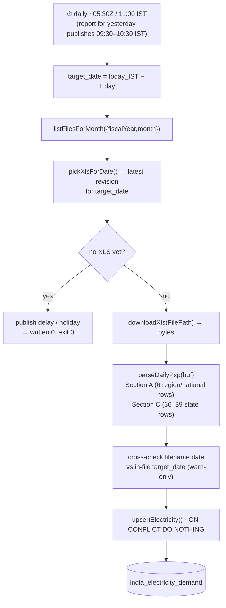
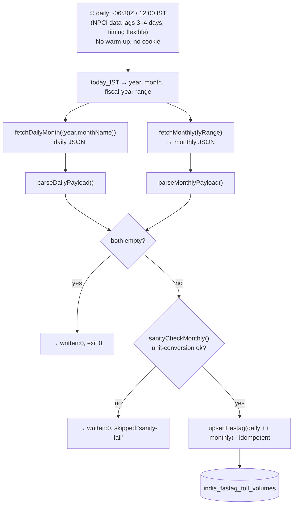

# SachNetra V2 — India Data Pipelines (end-to-end)

> Every live `seed-india-*` collector + its one-time backfill, drawn from source on 2026-06-05.
> Companion: [`v2-intelligence-pipeline.md`](./v2-intelligence-pipeline.md) (the news/signals pipeline, drawn in full).
>
> **One shared spine.** Every collector is a thin `fetchFn` wrapped by `runSeed()`
> (`scripts/_seed-utils.mjs`). The wrapper owns the distributed lock, retries,
> graceful-fail, Redis status key, freshness metadata, and the `exit 0` contract.
> The **data** itself lands in **Railway PostgreSQL** inside `fetchFn`; the Redis
> "canonical key" is a **STATUS key only** (except `signals`, which also hydrates
> the live digest/threads keys). Each is a **separate Railway cron** for failure isolation.

---

## 0 · The shared `runSeed()` lifecycle (every pipeline runs inside this)

**Invariant:** the cron **always `exit 0`** — a failed fetch never blocks the next run, and never crashes the Railway service. Stale data is preserved by extending the existing key's TTL.

---

## 1 · System map — all live India collectors

| Pipeline | Cadence | Source | Table | Idempotency |
|---|---|---|---|---|
| signals | 10 min | RSS | `india_news_signals` | `ON CONFLICT(headline_hash) DO NOTHING` |
| flows | daily ~14:00Z | Moneycontrol `__NEXT_DATA__` | `india_institutional_flows` (+ `india_flow_metrics`) | upsert, source-priority guard |
| announcements | hourly | NSE `/api/corporate-announcements` | `india_bourse_announcements` | upsert on `announcement_id` |
| options | daily ~10:30Z | NSE option-chain v3 | `india_options_oi` | upsert on `(date,symbol,expiry)` |
| deals | daily ~13:00Z | NSE bulk/block CSV | `india_bulk_block_deals` | upsert |
| macro | weekly | BIS SDMX | `india_macro_rates` + `…_series_meta` | upsert on `(series,period)` |
| rbi-wss | weekly Fri | RBI WSS XLSX | `india_rbi_wss` | upsert on `release_date` |
| electricity | daily ~05:30Z | Grid-India PSP `.xls` | `india_electricity_demand` | `ON CONFLICT DO NOTHING` |
| fastag | daily ~06:30Z | NPCI/NETC JSON | `india_fastag_toll_volumes` | upsert |

> `seed-india-digest.mjs` is **RETIRED** (V2-012) — `seed-india-signals` now hydrates the digest key directly. Not shown.

---

## 2 · FII/DII flows — `seed-india-flows` (+ NSDL backfill)

**Key points:** `net` falls back to `buy − sell` when absent. `source` priority — `nsdl` (authoritative, non-provisional) overwrites `moneycontrol`; the upsert `WHERE` guard enforces it so the backfill can run anytime. Metrics (`absorption_ratio`, MTD nets) are materialized from a view on every run.

---

## 3 · NSE bourse announcements — `seed-india-announcements` (+ backfill)

**Why hourly:** the alpha is "filings lead news by hours" — a once-daily run throws away the lead time. Append-only upsert makes the overlapping 2-day window free.

---

## 4 · NSE options OI (EOD) — `seed-india-options`

**Captures:** 3 indices × 3 expiries = up to 9 rows/day (front weekly + next + monthly = term structure). Idempotent — same-day re-run refreshes, never duplicates.

---

## 5 · NSE bulk & block deals — `seed-india-deals`

**Note:** NSE's bot wall sometimes *hangs* instead of returning 401/403 — `TimeoutError` is treated as a cookie wall and triggers one re-warm + retry.

---

## 6 · BIS India macro rates — `seed-india-macro` (+ backfill)

**Revision-safe:** re-fetches the trailing 3 years every week and upserts, so BIS's late revisions overwrite cleanly.

---

## 7 · RBI Weekly Statistical Supplement — `seed-india-rbi-wss` (+ backfill)

---

## 8 · POSOCO / Grid-India electricity — `seed-india-electricity`

---

## 9 · NPCI / NETC FASTag toll volumes — `seed-india-fastag`

**Guard:** a monthly unit-conversion sanity check runs *before* touching the DB, so a unit drift writes nothing rather than poisoning the series.

---

## Cross-cutting patterns (true for every collector)

1. **Thin `fetchFn`, fat wrapper** — all lock/retry/TTL/freshness logic lives once in `runSeed()`.
2. **Data → PostgreSQL, Redis key → status only** (except `signals`).
3. **Idempotent upserts** keyed on a natural business key — re-runs and overlapping windows are free.
4. **Holiday/pre-publish = clean no-op** (`written:0`, `exit 0`), never an error.
5. **NSE family shares the cookie warm-up** + 401/403 re-warm-once retry (announcements, options, deals).
6. **Separate cron per source** — one source breaking never touches the others or the news pipeline.
7. **Backfills mirror the live fetch**, just walk a historical window; safe to re-run; Lijo runs them once against prod after review.
