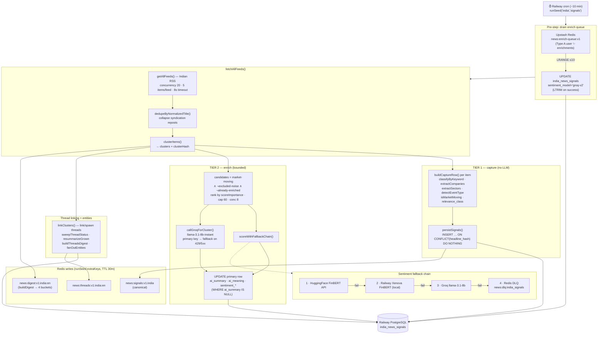

# V2 Intelligence Pipeline — `seed-india-signals.mjs`

> Autonomous Railway cron. Capture → Enrich → Thread → Digest.
> Drawn from `scripts/seed-india-signals.mjs` + `scripts/_sentiment-chain.mjs` (2026-06-05).
> Fire-and-forget: wrapped in `runSeed`, always `exit 0` so a failed cron never blocks the next.

## Key invariants
- **Tier 1 is total** — every headline row is persisted immediately, idempotent on `headline_hash`. No LLM gate.
- **Tier 2 is bounded** — only market-moving, non-noise, not-yet-enriched clusters; ranked, capped at 60/run (`GROQ_CAP`).
- **Re-enrich predicate** — a cluster is "done" only once its primary row has `ai_summary`; otherwise it stays a candidate for ≤48h (`SKIP_WINDOW_HOURS`).
- **Zero data loss** — sentiment falls HF → Xenova → Groq → DLQ; pipeline never throws.
- **Groq is the only Railway LLM call site** (`callGroqForCluster`), key failover primary → `GROQ_API_KEY_2` on 429/5xx/network.
