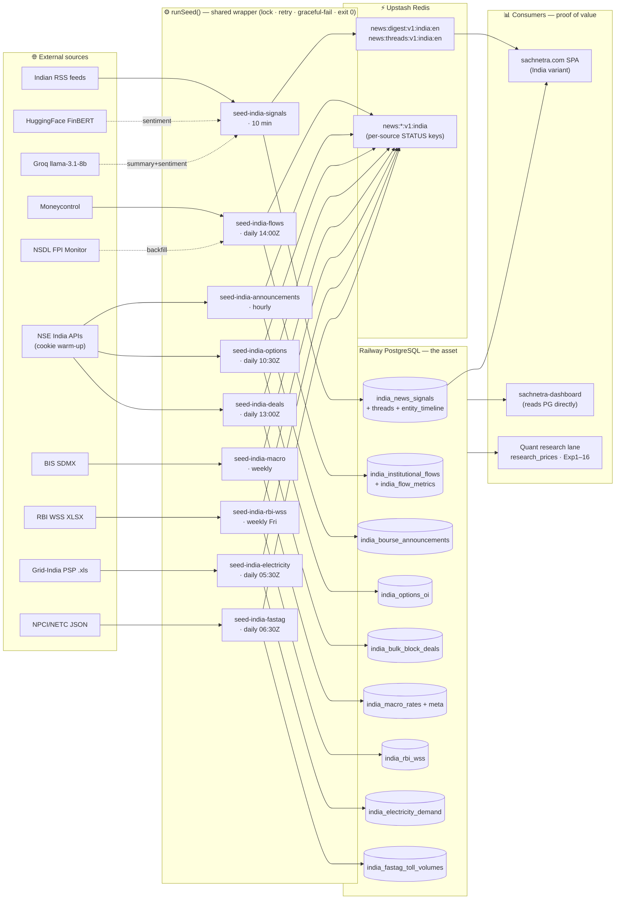

# SachNetra V2 — One-Page System Poster

> The whole collection engine on one canvas: every source → every cron → the database asset → consumers.
> Drawn from source 2026-06-05. Detail per pipeline: [`v2-india-pipelines.md`](./v2-india-pipelines.md) ·
> news internals: [`v2-intelligence-pipeline.md`](./v2-intelligence-pipeline.md).
>
> **Thesis (CLAUDE.md):** *SachNetra is the collection engine. The database is the asset. The quant system is the proof of value.*

## Reading the poster

- **Left → right = age of data lifecycle:** scrape → wrapped collector → durable store → display/research.
- **The spine is one function.** All 9 crons are thin `fetchFn`s inside `runSeed()`; only their source, table, and cadence differ. `signals` is the one that also hydrates live Redis digest/threads (the user-facing news); the other 8 write a **status key only** — their payload is the PostgreSQL rows.
- **Failure isolation:** every box in the spine is a **separate Railway cron**. One source breaking (NSE cookie wall, RBI not yet published, NPCI lag) fails that lane gracefully and never touches the others or the news pipeline.
- **The asset is the middle column.** Everything left of it is replaceable plumbing; everything right of it (SPA, dashboard, quant) is value extracted from the same store.

## The three jobs, in one sentence each
1. **Collection engine** (spine) — permanently record India market signals every run, independent of users.
2. **The asset** (PostgreSQL) — append-only, idempotent, revision-safe history nobody else is banking.
3. **Proof of value** (consumers) — the dashboard surfaces it; the quant lane (`research_prices`, Exp 1–16) proves a signal pays.
