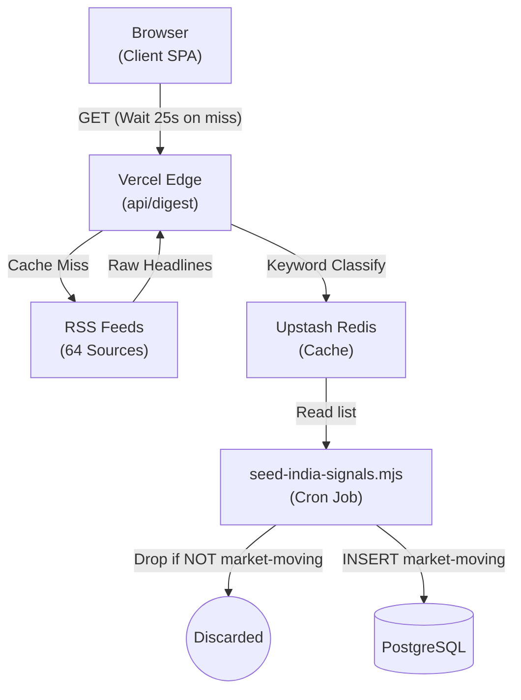
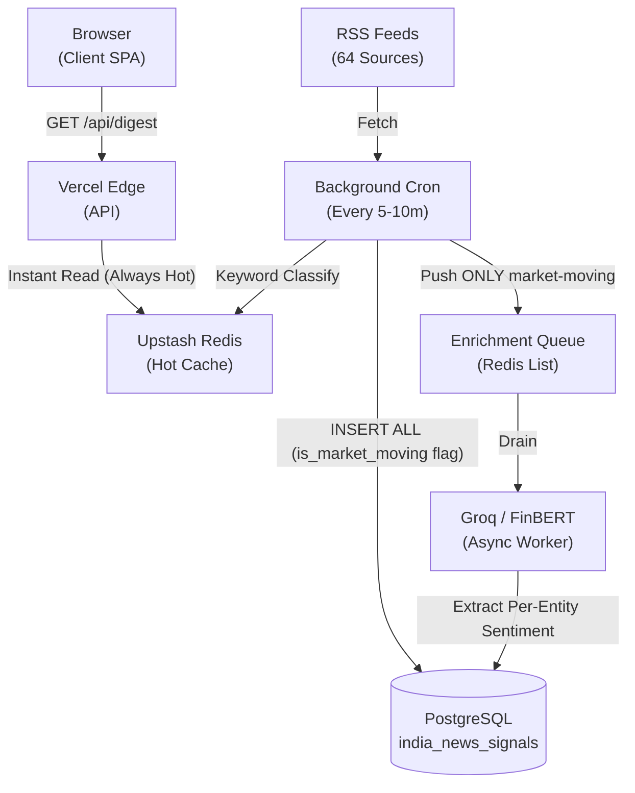

# SachNetra V2 Architecture Analysis & Fix Plan

## 1. The Exact Problems with the Current Pipeline

Based on the Claude conversation and your architecture logs, there are three distinct problems currently degrading SachNetra V2:

### A. Catastrophic Data Loss (The "Market-Moving" Filter)
Currently, `seed-india-signals.mjs` applies a destructive filter. It checks every headline against 12 keywords (`rbi`, `nifty`, `earnings`, etc.). If the headline **does not** match, it is skipped entirely. Over 80% of categorized news is being dropped before it ever reaches PostgreSQL. You are correctly pointing out that *every* headline is data and should be stored.

### B. Client Performance Bottleneck (The 25-Second Cold Start)
The app is loading very slowly because the client is absorbing the cost of data ingestion. When the Vercel Edge function (`api/digest`) gets a cache miss from Redis, it synchronously halts and fetches 64 RSS feeds to rebuild the digest. This causes a massive load delay (up to 25 seconds) on the frontend.

### C. Missing Entity-Aware Sentiment (Alpha Generation Failure)
As outlined in `academic_validation_entity_sentiment.md`, article-level sentiment is mathematically useless for Indian markets. You need **per-entity sentiment** (e.g., scoring HDFCBANK and LICHSGFIN differently on the same article). Your schema defines an `entity_sentiment` JSONB column for this exact purpose, but the current pipeline never populates it.

---

## 2. Architecture Diagrams

Here is how the system currently works vs. how it needs to work to fix these issues.

### Current Architecture (Flawed)

### Proposed Architecture (Best Practice)

---

## 3. How to Tackle This (Best Practices)

To align with the quantitative finance pivot and your established schema, here is the execution strategy:

### Step 1: Remove the Destructive Filter
Update `scripts/seed-india-signals.mjs`. Instead of `continue`ing (skipping) when a story is not market-moving, you must **store all of them**.
- Use the `is_market_moving` boolean column. Set it to `true` if it matches the keywords, and `false` if it doesn't.
- This ensures 100% data retention while still allowing you to quickly query for only market-moving news later.

### Step 2: Implement Entity-Aware Sentiment
Modify the enrichment queue worker. When it drains the queue of market-moving news, it should prompt the LLM (or FinBERT) to extract the specific companies mentioned and score them individually.
- Save this output into the `entity_sentiment` JSONB column. 
- Example JSON: `{"HDFCBANK.NS": {"score": 0.8, "label": "positive"}, "LICHSGFIN.NS": {"score": -0.6, "label": "negative"}}`.

### Step 3: Decouple Ingestion from the Client
The Vercel Edge function should **never** be responsible for fetching 64 RSS feeds. 
- A background worker (on Railway or a Cron job) should fetch the RSS feeds every 10 minutes and overwrite the Redis cache.
- The Vercel Edge function should *only* read from Redis. If Redis is empty, it returns an empty state or stale data rather than blocking for 25 seconds. This guarantees sub-second load times for the frontend.
