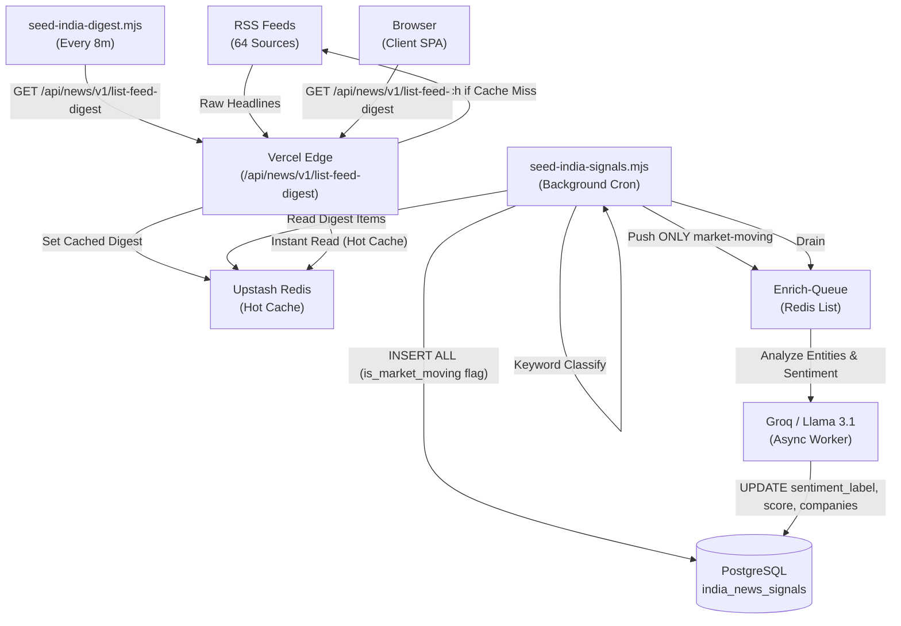

# SachNetra V2 Architecture Analysis

## 1. Current State of the Pipeline

The architecture has been successfully updated to resolve the three primary issues that were previously degrading SachNetra V2:

### A. Data Retention (Resolved "Market-Moving" Filter)
`scripts/seed-india-signals.mjs` now retains 100% of scraped headlines. The destructive filter was replaced with an `is_market_moving` boolean flag. All data is successfully persisted to PostgreSQL (`india_news_signals`) without data loss, and only market-moving news is automatically forwarded to the enrichment queue.

### B. Client Performance (Resolved 25-Second Cold Start)
The Vercel Edge function (`api/digest`) no longer absorbs the cost of data ingestion. A background service (`scripts/seed-india-digest.mjs`) running on Railway pre-warms the India digest in the Redis cache every 8 minutes. The Vercel API now acts primarily as a fast read-layer, guaranteeing sub-second load times for the frontend.

### C. Entity-Aware Sentiment (Resolved Alpha Generation Failure)
The system now successfully extracts per-entity sentiment. The `drainEnrichQueue()` function in the signals cron automatically processes market-moving items using the Groq LLM. It populates the `companies`, `sentiment_label`, `sentiment_score`, and `event_type` columns in PostgreSQL, aligning with quantitative finance requirements.

---

## 2. Architecture Diagram (Current)

Based on the latest codebase, here is the functional architecture of the SachNetra intelligence pipeline.

---

## 3. Best Practices Maintained

- **Decoupled Ingestion:** The client is isolated from RSS parsing and Groq enrichment delays.
- **100% Data Capture:** Future quant modeling has access to all headlines, not just the currently defined "market-moving" ones.
- **Entity Granularity:** Sentiment is tied directly to NSE tickers, supporting advanced alpha generation.
