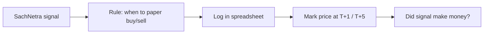

# R10 — How to start (Lijo)

**Main goal (2026-05-27):** Make money eventually by **paper trading** **alpha signals** SachNetra produces (news, filings, flows, sentiment) — not live trading yet.

---

## Step 1 — You’re already set up

These are filled:

- [`R10_lijo_questionnaire.md`](./R10_lijo_questionnaire.md)
- [`R10_lijo_context_note.md`](./R10_lijo_context_note.md)
- [`R10_antigravity_agent_instructions.md`](./R10_antigravity_agent_instructions.md)
- [`R10_founder_monetization_gaps_osint.md`](./R10_founder_monetization_gaps_osint.md)

---

## Step 2 — Run Antigravity (one session)

1. Open **Antigravity** (or Gemini agent with browser/search).
2. Copy the block below into a **new chat**.
3. Let it run until all files appear in `scratch/app_vision_research/output/R10/`.
4. Send Claude the path or paste `R10_executive_summary_for_lijo.md` for audit + wiki update.

### Copy-paste block

```
Research only — no code.

Read FIRST:
- scratch/app_vision_research/R10_how_to_start.md
- scratch/app_vision_research/R10_lijo_questionnaire.md
- scratch/app_vision_research/R10_lijo_context_note.md
- scratch/app_vision_research/lijo_answers.md §12
- scratch/app_vision_research/R10_antigravity_agent_instructions.md
- scratch/app_vision_research/R10_founder_monetization_gaps_osint.md

PRIMARY GOAL: Paper trade alpha signals from SachNetra (news/sentiment/filings/flows/G1). Lijo never live traded. Prove edge on paper first; ₹50k/month is longer-term. B2B cold calls OK; no stable 30-day export (pipeline changing).

Follow R10_antigravity_agent_instructions.md exactly.
Output: scratch/app_vision_research/output/R10/
≥3 OSINT iterations in R10_osint_iteration_log.md
Deliver R10_executive_summary_for_lijo.md in plain English.

Do not edit app_vision_2026.md.
```

---

## Step 3 — Read one file when done

Open: `output/R10/R10_executive_summary_for_lijo.md`  
Then: `R10_gap_registry.csv` — look at rows tagged **P0**.

---

## Step 4 — Paper trading loop (what “success” looks like)

After R10, you (or James) implement the **minimum loop**:



R10 should name **which signals exist today** (e.g. filing alert, sentiment spike, FII day) and what’s missing (signal table, prices, journal).

---

## Step 5 — Optional parallel (not blocking paper trade)

- **B2B pilot** — secondary; needs honest sample CSV (R10 will spec).
- **V2-031b** — keeps improving G1 (signal quality).

---

## What NOT to do first

- Live trading with real money  
- Promise buyers a frozen 30-day dataset  
- Build Hindi app / mobile app (you said cut these)
