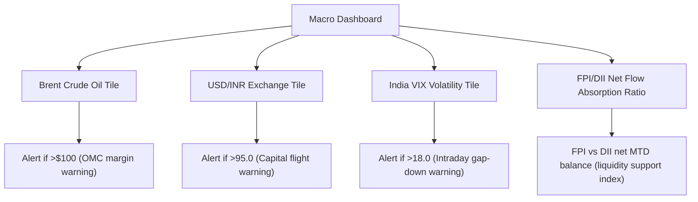

# R07 — SachNetra Product Implications

*Author: Antigravity · Status: Active · As-of: 27-May-2026*

This document translates the historical findings of the R07 brief into concrete product recommendations and backend database schema mappings for SachNetra. It outlines how the platform should ingest, tag, and display geopolitical and macroeconomic shocks in real-time.

---

## 1. News Ingestion Schema Mapping (`india_news_signals` fields)

To ensure that unstructured news regarding geopolitical shocks is mapped directly to our database signals, we define the following standard field mappings for the `india_news_signals` table:

| Field Name | Type | Allowed Values / Formats | Ingestion Logic & Rules |
| :--- | :--- | :--- | :--- |
| `event_type` | `VARCHAR` | `geopolitical_clash`, `oil_macro_shock`, `rate_decision`, `corp_governance_crisis`, `election_policy_shift`, `supply_chain_disruption` | Tagged by NLP parser when headlines match key lexicons (e.g. "conflict", "SWIFT", "SWIFT ban", "sanctions", "Hormuz", "tariff", "FPO cancel"). |
| `thread` | `VARCHAR` | `middle_east_crisis_2026`, `russia_ukraine_war`, `adani_hindenburg_crisis`, `us_fed_monetary_tightening`, `india_elections_2024` | Grouping key that clusters articles sequentially over a 90-day window to prevent news feed fragmentation. |
| `sector` | `VARCHAR` | `defence`, `omc`, `metals`, `energy`, `it`, `psu_bank`, `fmcg`, `pharma` | Assigned based on entity matching (e.g. HAL -> `defence`, IOCL -> `omc`, SBI -> `psu_bank`). |
| `ticker` | `VARCHAR` | `HAL`, `BEL`, `IOC`, `BPCL`, `HPCL`, `TATASTEEL`, `JSWSTEEL`, `COALINDIA`, `RELIANCE`, `SBIN`, `TCS`, `INFY` | Maps specific G1 high-beta/exposed tickers detected in the text. |
| `impact_score` | `DECIMAL` | `1.00` to `5.00` | Calculated dynamically based on VIX levels and Nifty gap sizes on publication date. |

---

## 2. G1 Ticker Whitelist & Monitoring Priorities

Geopolitical shocks do not impact the entire index equally. The following Whitelist of **G1 Tickers** must be prioritized for real-time filing and news alerts during geopolitical/macro shocks:

| Ticker | Company Name | Sector | Geopolitical Sensitivity | Transmission Channel |
| :--- | :--- | :--- | :--- | :--- |
| **HAL** | Hindustan Aeronautics Ltd | Defence | High | Government capex priority; import substitution. |
| **BEL** | Bharat Electronics Ltd | Defence | High | Electronics defense contracts; domestic localization. |
| **IOC** / **BPCL** | Indian Oil / BPCL | OMC | Very High | Underperformance on rising crude; gross refining margins. |
| **COALINDIA** | Coal India Ltd | Energy | Medium | High global coal prices shift demand to domestic supply. |
| **RELIANCE** | Reliance Industries Ltd | Energy / OMC | High | Export refining margins; global energy pricing. |
| **TATASTEEL** | Tata Steel Ltd | Metals | High | Global base metal price spikes; European operations exposure. |
| **SBIN** | State Bank of India | PSU Bank | Medium | High-leverage conglomerate debt exposure concerns. |
| **TCS** / **INFY** | TCS / Infosys | IT | High | Global client IT spending freezes; USD appreciation tailwind. |

---

## 3. Macro Dashboard UI Tiles (War & Geopolitics Regimes)

When a geopolitical thread is active (e.g., VIX > 15.0 or Brent > $100/bbl), the SachNetra dashboard should dynamically display a **Macro Shock Tile Group** containing the following metrics:

### Tile Specifications:
1.  **Brent Crude Oil Tile:**
    *   *Green State:* <$80/bbl (positive for Indian trade deficit, OMCs).
    *   *Amber State:* $80–$100/bbl (manageable inflation pressure).
    *   *Red Alert:* >$100/bbl (warning on inflation pass-through, margins).
2.  **USD/INR Exchange Tile:**
    *   *Warning Threshold:* >95.00 (indicates high pressure on import bills and triggers FPI equity sales). Cites REER level (~91 in April 2026) as context.
3.  **FPI vs. DII Net Flow Absorption Ratio:**
    *   Displays `MTD DII Net Buy / MTD FPI Net Sell` (e.g., in May 2026: **₹63,445 cr / ₹34,469 cr = 1.84**).
    *   An absorption ratio **> 1.0** indicates domestic mutual fund flows are fully absorbing foreign exits, keeping the market resilient.
